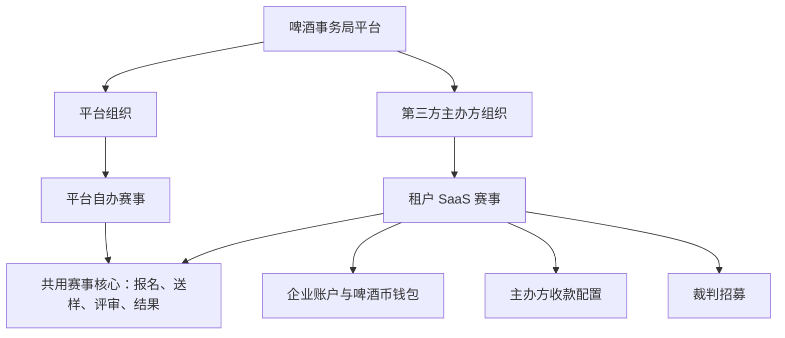

# 二期 SaaS 化总体方案

> 状态：已确认总体方向，进入详细设计阶段  
> 最后确认：2026-07-27  
> 用途：说明二期的产品边界、总体架构和对一期的改造原则。详细规则见 `02-详细设计/`，重要结论见 `90-决策记录.md`。

## 1. 建设背景与目标

一期系统服务啤酒事务局自办比赛，已经具备赛事配置、微信自动支付、厂商报名、送样、评审、奖项和公开结果等能力。后台管理员共用全量数据空间，比赛是当前最主要的数据范围边界。

二期在不复制赛事核心能力的前提下，为第三方赛事主办方提供 SaaS 服务。系统同时承载两类比赛：

| 比赛类型 | 主办方 | 报名费收款 | 平台计费 |
| --- | --- | --- | --- |
| 平台自办赛事 | 啤酒事务局 | 延续一期微信自动支付、银行转账和现有退款能力 | 不使用啤酒币 |
| 租户 SaaS 赛事 | 第三方主办方 | 主办方配置微信收款码和/或银行账户，主办方手工确认 | 按啤酒币规则计费 |

二期目标是让两类比赛共用比赛、报名、评审和结果能力，同时确保租户间的数据、文件、收款信息和操作权限相互隔离。

## 2. 已确认的建设范围

### 2.1 主办方组织与后台

- 二期暂不开放第三方自助注册。平台超级管理员创建主办方组织并分发后台账号。
- 后台只保留三类有效操作身份：平台超级管理员、平台赛事管理员、主办方管理员。
- 同一主办方下的管理员权限一致；不在二期区分“负责人”和“工作人员”的操作权限。负责人仅作为主联系人或初始账号标记。
- 平台超级管理员可查看全平台数据；平台赛事管理员仅管理啤酒事务局自办赛事；主办方管理员仅管理本组织赛事。

### 2.2 租户赛事报名费

- 每场租户赛事可独立启用微信收款码、银行转账，或两者同时启用。
- 报名费直接进入实际主办方账户。平台只展示收款信息、记录报名付款状态，不承担资金代收、分账、对账或原路退款责任。
- 租户赛事的微信收款码和银行转账均由主办方手工确认；银行转账可沿用付款凭证上传能力。
- 租户赛事退款在线下完成，主办方在系统中记录“已退款/已取消”。平台自办赛事继续沿用一期的微信退款能力。

### 2.3 啤酒币

- 仅租户 SaaS 赛事使用啤酒币；啤酒事务局自办赛事不扣币。
- 租户可在线购买啤酒币，支付成功后自动到账；平台仍保留受审计的人工更正能力。
- 每批啤酒币自到账日起有效 1 年，按最早到期批次优先扣减，不可转让，原则上不退款。
- 租户赛事开放报名时先扣 1 枚；报名截止后，主办方确认有效酒款并进入评审准备时，按 `max(1, ceil(有效酒款数 / 10))` 结算总消耗并补扣差额。
- 结算成功后锁定计费基数。后续新增酒款若提高计费档位，须补扣后才可分组；删除或取消酒款不自动退币。
- 酒款评测平台尚未开发。二期的钱包按通用企业账户设计，赛事 SaaS 先作为唯一使用方；未来酒款评测平台复用同一账户、余额和流水。

### 2.4 裁判招募与公开展示

- 裁判在 Judge H5 查看开放招募的赛事并提交申请及可参加场次。
- 主办方在后台筛选申请人、设置录用/候补/不录用，并在后续评审编排中安排具体桌次和角色。
- 主办方仅能查看申请本组织赛事的裁判资料，资料展示遵循最小必要原则；平台管理完整裁判资源库。
- 第三方赛事的报名、裁判招募和已发布结果统一展示在啤酒事务局平台，并明确显示实际主办方名称和标识。

## 3. 总体架构原则

- 不新建第二套比赛、报名或评审系统。`competition` 继续作为赛事业务聚合根，新增主办方归属。
- 组织归属是后台数据范围的第一层边界；比赛归属是报名、评审、结果等业务数据的追溯边界。
- 所有后台服务在读取或修改比赛及其子资源前，都必须完成“当前账号是否有该比赛所属组织权限”的校验。
- 一期平台自办流程必须保持可用，租户规则只在第三方主办方组织的比赛中生效。
- 啤酒币钱包归属通用企业账户，不能命名或实现为一次性“赛事余额”。

## 4. 对一期实现的主要影响

| 一期现状 | 二期改造方向 |
| --- | --- |
| `ADMIN` 后台角色共享全量管理空间 | 保留后台入口，增加平台/主办方身份和组织数据范围校验 |
| `competition` 未归属任何组织 | 为比赛增加主办方组织归属；历史比赛归属啤酒事务局平台组织 |
| 统一微信自动支付、银行转账、退款 | 平台自办赛事保留；租户赛事改为主办方收款信息展示和手工确认 |
| 无啤酒币和账务域 | 新增企业账户、商品、购买订单、充值批次、流水、扣减分摊和赛事结算 |
| 评审账号可跨比赛使用，未提供招募 | 保留统一评审账号；新增招募、申请、录用和可参加场次 |
| 公开赛事和结果未标注实际主办方 | 在公共赛事、招募和结果页面补充主办方信息 |

## 5. 文档导航与开发前提

开发二期功能前，先阅读：

1. `docs/01-一期-系统基线/01-系统基线.md` 和业务流程文档，确认不可破坏的一期能力。
2. 本文件，确认双模式赛事和总体边界。
3. `90-决策记录.md`，确认已经拍板的业务选择。
4. `02-详细设计/` 中与任务直接相关的文档。
5. `03-实施计划.md`，确认依赖、迁移顺序和验收要求。

本阶段尚未授权直接修改数据库或业务代码。所有实现应先完成对应详细设计中的字段、状态、接口和迁移评审。
