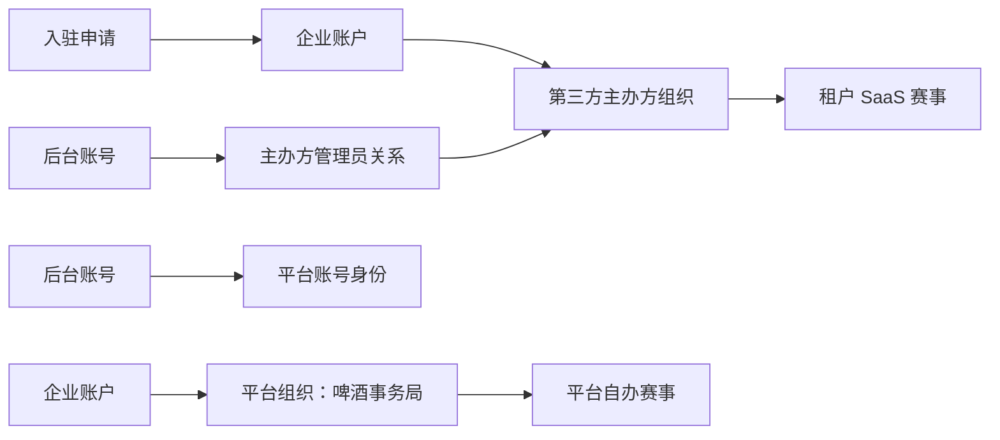

# 组织、权限与数据隔离设计

> 状态：已确认设计  
> 对应决策：`SaaS-ADR-001`、`SaaS-ADR-002`、`SaaS-ADR-003`、`SaaS-ADR-004`  
> 适用范围：主办方组织、后台账号、比赛归属、接口鉴权、导出、文件和审计。

> 当前实现基线（2026-08-24）：一期后端已完成比赛、报名、评审等核心巨型门面的第一轮模块化拆分。组织基线迁移已执行，新增企业账户、主办方、成员关系和入驻申请表；历史比赛和可追溯文件已回填平台组织，操作日志已补充组织/比赛字段并对缺失字段提供 SQL 追溯过滤。入驻申请、平台审核、幂等账号发放、JWT 后台身份与首次改密、`CompetitionAccessService`、`FileAccessService` 均已落地。比赛、报名、支付/退款、评审、轮次、奖项、现场看板、反馈、导出和文件入口已接入第一轮组织范围校验；评委后台使用 `JudgeAccessService` 按已分配比赛追溯范围，操作日志在 Mapper SQL 层按组织过滤。仍待实施的是租户收款、啤酒币、裁判招募以及公共页面主办方展示。

## 1. 目标与术语

二期新增“主办方组织”作为第三方赛事的业务和数据边界。术语含义如下：

| 术语 | 含义 | 是否是登录角色 |
| --- | --- | --- |
| 企业账户 | 啤酒币钱包的通用归属主体；未来可供酒款评测平台复用 | 否 |
| 主办方组织 | 可创建、运营赛事的组织；啤酒事务局也是一个平台组织 | 否 |
| 主办方入驻申请 | 第三方主办方提交的待审核资料和开通记录 | 否 |
| 申请人 | 通过申请编号和联系人验证信息查询、补充入驻申请的外部用户 | 否 |
| 主办方管理员 | 属于某个主办方组织的后台账号 | 是 |
| 平台超级管理员 | 平台方全局管理账号 | 是 |
| 平台赛事管理员 | 仅运营啤酒事务局自办赛事的后台账号 | 是 |

“租户”是技术和数据隔离概念，前端业务文案统一使用“主办方”。不创建名为“租户”的登录角色。

## 2. 主办方入驻与账号开通

第三方主办方通过公开入驻入口提交申请。申请记录和后台账号分开管理，提交申请不会自动获得后台访问权限。

### 2.1 申请提交

申请表至少收集：

- 企业或组织名称
- 联系人姓名、手机号，以及可选的邮箱和微信号；
- 办赛简介、预计赛事规模和主办方补充说明；
- 营业执照或主体证明等必要材料。

提交成功后生成唯一申请编号，申请状态为 `SUBMITTED`。申请人可通过申请编号和联系人验证信息查询状态；查询接口必须限流，并只返回脱敏后的主体和联系人信息。申请人只有在 `NEED_MORE_INFO` 状态下才能修改资料并重新提交，不能使用申请记录直接调用后台接口，也不能以申请人身份登录后台。

### 2.2 平台审核

只有平台超级管理员可以查看和处理全部入驻申请。审核状态如下：

| 状态 | 含义 | 后续动作 |
| --- | --- | --- |
| `SUBMITTED` | 已提交，等待处理 | 平台超级管理员开始审核 |
| `UNDER_REVIEW` | 审核中 | 记录审核人和处理时间 |
| `NEED_MORE_INFO` | 需要补充资料 | 申请人修改后重新提交 |
| `APPROVED` | 审核通过，等待账号发放事务完成 | 自动触发或由平台超级管理员重试账号发放 |
| `ACCOUNT_ISSUED` | 组织和初始账号已创建 | 向联系人交付凭据 |
| `REJECTED` | 本次申请未通过 | 保留原因；重新申请使用新申请单 |

每次审核动作都必须记录操作人、时间、结果和备注。审核历史写入 `admin_operation_log`，目标类型使用 `ORGANIZER_APPLICATION`；日志中只保存结果和脱敏说明，不保存证件原文、密码或其他不必要的敏感内容。平台赛事管理员与主办方管理员不能查看或处理入驻申请。

### 2.3 审核通过与账号发放

平台超级管理员点击通过后，审核事务先将申请置为 `APPROVED` 并记录审核结果；随后进入账号发放事务：

1. 创建一个 `enterprise_account`。
2. 创建一个类型为 `TENANT` 的 `organizer`，并关联企业账户。
3. 创建初始 `admin_user`，`admin_type` 为 `ORGANIZER_ADMIN`。
4. 创建 `organizer_member`，建立初始管理员与主办方组织的关系。
5. 回写申请单的组织、管理员和账号发放信息，将状态推进为 `ACCOUNT_ISSUED`。

账号发放事务按申请单加锁执行。事务失败时回滚组织、账号和成员关系，申请保持 `APPROVED`，平台超级管理员可以重试；事务成功后重复请求直接返回已有开通结果，不能再次生成组织或管理员。

初始管理员首次改密后，可以在本组织内创建、重置或停用其他 `ORGANIZER_ADMIN` 账号

## 3. 权限模型

| 能力 | 平台超级管理员 | 平台赛事管理员 | 主办方管理员 |
| --- | ---:| ---:| ---:|
| 审核入驻申请和发放初始账号 | 是 | 否 | 否 |
| 创建和停用主办方组织 | 仅通过审核申请创建；可停用 | 否 | 否 |
| 创建、重置、停用主办方管理员 | 是，全平台 | 否 | 是，仅本组织 |
| 查看全平台赛事与运营数据 | 是 | 否 | 否 |
| 管理啤酒事务局自办赛事 | 是 | 是 | 否 |
| 管理所属主办方赛事 | 是 | 否 | 是 |
| 配置租户赛事收款信息 | 是 | 否 | 是 |
| 在线购买、查看本组织啤酒币 | 可管理全量及人工更正 | 否 | 是，仅本组织 |
| 处理本组织报名、收样、评审和结果 | 是 | 仅平台赛事 | 是，仅本组织 |
| 查看完整裁判资源库 | 是 | 仅平台赛事所需范围 | 否；当前阶段仅查看本组织已分配评委，招募申请落地后扩展为本组织申请人 |
| 查看操作审计 | 是 | 仅平台赛事 | 仅本组织 |

同一主办方的管理员权限完全一致。二期不实现主办方内部岗位级权限配置、审批流或负责人专属权限；平台超级管理员对入驻申请的审核属于平台开通流程。

## 4. 组织归属关系



- 一个主办方组织关联一个企业账户；二期可按一对一实现，数据模型不阻断未来扩展。
- 所有 `competition` 必须归属一个主办方组织。
- 啤酒事务局创建一个固定的平台组织。历史比赛全部归属该组织，因此继续采用一期的自办赛事规则。
- 参赛厂牌 `brewery`、厂商账号 `portal_account` 与主办方组织是不同概念，不能混用同一张表。

## 5. 后台认证与数据范围

当前后端通过 JWT 中的 `role=ADMIN` 和 `/api/admin/**` 路径完成后台鉴权。二期保留该入口和基础角色，新增后台身份与组织范围信息。

建议会话包含：

| 会话字段 | 含义 |
| --- | --- |
| `uid` | 后台账号 ID |
| `role` | 继续使用 `ADMIN`，维持路由兼容 |
| `adminType` | `PLATFORM_SUPER_ADMIN`、`PLATFORM_EVENT_ADMIN`、`ORGANIZER_ADMIN` |
| `organizerId` | 主办方管理员所属组织；平台账号为空 |
| `mustChangePassword` | 初始账号或重置密码后的强制改密标记 |

`AuthInterceptor` 只负责识别登录身份。具体资源范围必须在 Service 层完成，禁止控制器依赖前端隐藏按钮来实现权限隔离。

当 `mustChangePassword=true` 时，登录后只允许访问修改密码、退出登录和必要的会话接口；密码修改成功后清除该标记，再开放正常后台功能。

建议新增统一能力：

```text
requirePlatformSuperAdmin()
requireCompetitionAccess(competitionId)
requireOrganizerAccess(organizerId)
requireOwnedResourceAccess(resourceId, resourceType)
```

资源校验原则：

1. 先读取资源对应比赛或组织。
2. 再校验当前后台身份是否可访问该组织。
3. 最后执行查询或修改。

任何由 ID 直接访问的详情、编辑、删除、下载、导出、支付确认、评审操作都必须执行该顺序。

## 6. 需要改造的现有范围

| 现有模块 | 二期处理要求 |
| --- | --- |
| 入驻申请与账号开通 | 公开提交申请；仅平台超级管理员审核；通过后创建组织、初始管理员和成员关系；全流程记录审计 |
| 赛事列表、创建、详情、状态推进 | 按主办方组织筛选；创建时自动使用当前主办方组织；平台超级管理员可指定或切换组织视图 |
| 报名、送样、收样、退款、银行转账 | 通过所属比赛确认组织权限，不能只按酒款或付款单 ID 直接处理 |
| 评审、分桌、轮次、奖项、现场看板 | 通过比赛归属校验；评审匿名规则保持不变 |
| 导出和证书、标签、付款凭证下载 | 文件所属比赛或组织必须与当前权限范围一致 |
| 风格库 | 公共风格库由平台超级管理员维护；主办方仅引用并生成本赛事配置快照 |
| 操作日志 | 写入操作者、目标比赛和组织归属；查询按身份范围过滤 |

## 7. 文件与公开访问边界

- 主办方上传的收款二维码、Logo、报名凭证、证书等文件必须有可追溯组织范围。
- 文件下载接口必须重复业务资源的组织校验；不能因知道 `file_asset.id` 就获得下载权限。
- 无法从业务关联追溯组织的敏感文件保留元数据但清空 `public_url`，由应用层拒绝下载；对象存储前缀仍需配置为私有。
- 公共赛事图片、已公开结果证书等需要明确公共访问白名单，不能将本地主办方文件目录整体公开。
- 评审端继续保持匿名，不因主办方组织引入而向评审展示厂牌、酒名、联系人或收款信息。

## 8. 历史数据迁移规则

首次二期迁移时：

1. 创建“啤酒事务局”平台组织及其企业账户。
2. 所有已有 `competition` 回填为该组织所属。
3. 所有已有后台账号标记为平台账号；具体是超级管理员还是赛事管理员，由迁移前配置或首次管理员操作确定。
4. 旧比赛保持平台自办规则：继续使用原微信支付、银行转账和退款逻辑，免啤酒币。
5. 不给所有报名、评分、轮次表重复写组织 ID；通过 `competition_id → organizer_id` 追溯归属。独立文件和审计记录按详细数据库设计补充范围字段。

## 9. 验收重点

- 任意主办方管理员无法读取、修改、下载或导出其他主办方数据。
- 未审核通过的入驻申请不能登录后台、创建组织或创建比赛。
- 平台赛事管理员和主办方管理员不能查看或处理入驻申请。
- 审核通过只能创建一套企业账户、主办方组织和初始管理员凭据。
- 初始密码不会以明文写入数据库和日志，首次登录必须修改密码。
- 平台赛事管理员无法操作第三方主办方数据。
- 平台超级管理员可在不绕过业务状态校验的前提下处理全平台问题。
- 历史比赛在新版本中仍能完成一期全流程。
- 任意文件 ID、比赛 ID、酒款 ID、付款单 ID、评审桌 ID 的越权尝试均得到拒绝。
