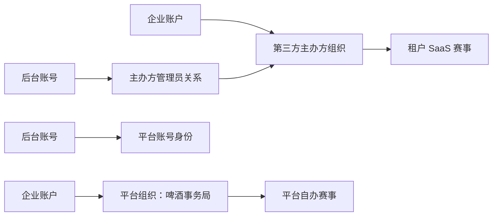

# 组织、权限与数据隔离设计

> 状态：已确认设计  
> 对应决策：`SaaS-ADR-001`、`SaaS-ADR-002`、`SaaS-ADR-003`、`SaaS-ADR-004`  
> 适用范围：主办方组织、后台账号、比赛归属、接口鉴权、导出、文件和审计。

## 1. 目标与术语

二期新增“主办方组织”作为第三方赛事的业务和数据边界。术语含义如下：

| 术语 | 含义 | 是否是登录角色 |
| --- | --- | --- |
| 企业账户 | 啤酒币钱包的通用归属主体；未来可供酒款评测平台复用 | 否 |
| 主办方组织 | 可创建、运营赛事的组织；啤酒事务局也是一个平台组织 | 否 |
| 主办方管理员 | 属于某个主办方组织的后台账号 | 是 |
| 平台超级管理员 | 平台方全局管理账号 | 是 |
| 平台赛事管理员 | 仅运营啤酒事务局自办赛事的后台账号 | 是 |

“租户”是技术和数据隔离概念，前端业务文案统一使用“主办方”。不创建名为“租户”的登录角色。

## 2. 权限模型

| 能力 | 平台超级管理员 | 平台赛事管理员 | 主办方管理员 |
| --- | ---:| ---:| ---:|
| 创建和停用主办方组织 | 是 | 否 | 否 |
| 创建、重置、停用主办方管理员 | 是 | 否 | 否 |
| 查看全平台赛事与运营数据 | 是 | 否 | 否 |
| 管理啤酒事务局自办赛事 | 是 | 是 | 否 |
| 管理所属主办方赛事 | 是 | 否 | 是 |
| 配置租户赛事收款信息 | 是 | 否 | 是 |
| 在线购买、查看本组织啤酒币 | 可管理全量及人工更正 | 否 | 是，仅本组织 |
| 处理本组织报名、收样、评审和结果 | 是 | 仅平台赛事 | 是，仅本组织 |
| 查看完整裁判资源库 | 是 | 仅平台赛事所需范围 | 否，仅查看本赛事申请人 |
| 查看操作审计 | 是 | 仅平台赛事 | 仅本组织 |

同一主办方的管理员权限完全一致。二期不实现岗位级权限配置、审批流或负责人专属权限。

## 3. 组织归属关系



- 一个主办方组织关联一个企业账户；二期可按一对一实现，数据模型不阻断未来扩展。
- 所有 `competition` 必须归属一个主办方组织。
- 啤酒事务局创建一个固定的平台组织。历史比赛全部归属该组织，因此继续采用一期的自办赛事规则。
- 参赛厂牌 `brewery`、厂商账号 `portal_account` 与主办方组织是不同概念，不能混用同一张表。

## 4. 后台认证与数据范围

当前后端通过 JWT 中的 `role=ADMIN` 和 `/api/admin/**` 路径完成后台鉴权。二期保留该入口和基础角色，新增后台身份与组织范围信息。

建议会话包含：

| 会话字段 | 含义 |
| --- | --- |
| `uid` | 后台账号 ID |
| `role` | 继续使用 `ADMIN`，维持路由兼容 |
| `adminType` | `PLATFORM_SUPER_ADMIN`、`PLATFORM_EVENT_ADMIN`、`ORGANIZER_ADMIN` |
| `organizerId` | 主办方管理员所属组织；平台账号为空 |

`AuthInterceptor` 只负责识别登录身份。具体资源范围必须在 Service 层完成，禁止控制器依赖前端隐藏按钮来实现权限隔离。

建议新增统一能力：

```text
requirePlatformSuperAdmin()
requireCompetitionAccess(competitionId)
requireOrganizerAccess(organizerId)
requireOwnedResourceAccess(resourceId, resourceType)
```

资源校验原则：

1. 先读取资源对应比赛或组织。
2. 再校验当前后台身份是否可访问该组织。
3. 最后执行查询或修改。

任何由 ID 直接访问的详情、编辑、删除、下载、导出、支付确认、评审操作都必须执行该顺序。

## 5. 需要改造的现有范围

| 现有模块 | 二期处理要求 |
| --- | --- |
| 赛事列表、创建、详情、状态推进 | 按主办方组织筛选；创建时自动使用当前主办方组织；平台超级管理员可指定或切换组织视图 |
| 报名、送样、收样、退款、银行转账 | 通过所属比赛确认组织权限，不能只按酒款或付款单 ID 直接处理 |
| 评审、分桌、轮次、奖项、现场看板 | 通过比赛归属校验；评审匿名规则保持不变 |
| 导出和证书、标签、付款凭证下载 | 文件所属比赛或组织必须与当前权限范围一致 |
| 风格库 | 公共风格库由平台超级管理员维护；主办方仅引用并生成本赛事配置快照 |
| 操作日志 | 写入操作者、目标比赛和组织归属；查询按身份范围过滤 |

## 6. 文件与公开访问边界

- 主办方上传的收款二维码、Logo、报名凭证、证书等文件必须有可追溯组织范围。
- 文件下载接口必须重复业务资源的组织校验；不能因知道 `file_asset.id` 就获得下载权限。
- 公共赛事图片、已公开结果证书等需要明确公共访问白名单，不能将本地主办方文件目录整体公开。
- 评审端继续保持匿名，不因主办方组织引入而向评审展示厂牌、酒名、联系人或收款信息。

## 7. 历史数据迁移规则

首次二期迁移时：

1. 创建“啤酒事务局”平台组织及其企业账户。
2. 所有已有 `competition` 回填为该组织所属。
3. 所有已有后台账号标记为平台账号；具体是超级管理员还是赛事管理员，由迁移前配置或首次管理员操作确定。
4. 旧比赛保持平台自办规则：继续使用原微信支付、银行转账和退款逻辑，免啤酒币。
5. 不给所有报名、评分、轮次表重复写组织 ID；通过 `competition_id → organizer_id` 追溯归属。独立文件和审计记录按详细数据库设计补充范围字段。

## 8. 验收重点

- 任意主办方管理员无法读取、修改、下载或导出其他主办方数据。
- 平台赛事管理员无法操作第三方主办方数据。
- 平台超级管理员可在不绕过业务状态校验的前提下处理全平台问题。
- 历史比赛在新版本中仍能完成一期全流程。
- 任意文件 ID、比赛 ID、酒款 ID、付款单 ID、评审桌 ID 的越权尝试均得到拒绝。

