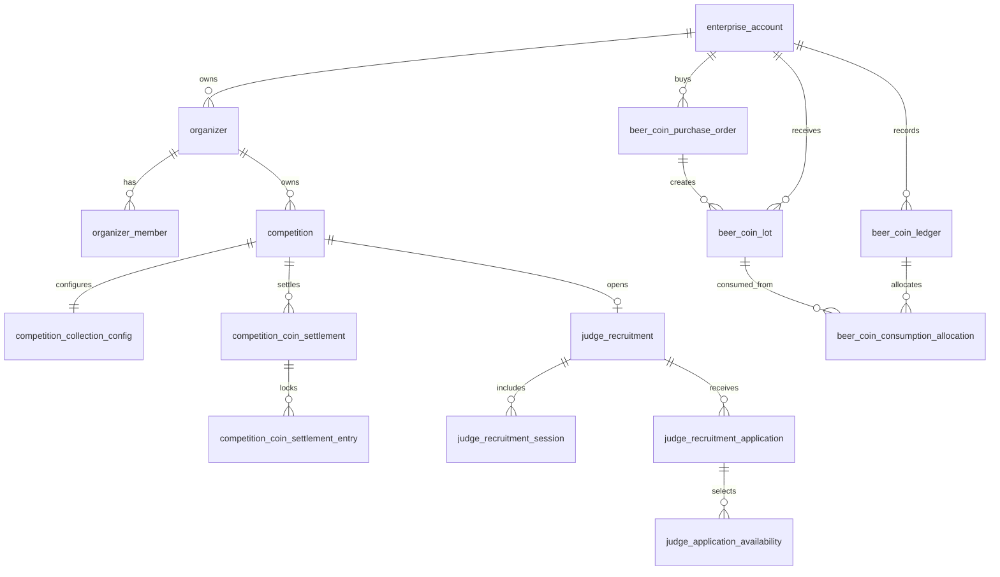

# 二期数据库迁移设计

> 状态：逻辑方案已定，尚未形成可执行 SQL  
> 依据：一期当前数据库 40 张表、无物理外键；完整基线为 `beer-competition-api/src/main/resources/db/migrations/beer_competition_full.sql`。  
> 用途：在改代码前确定二期新增数据域、既有表改动、历史回填、索引、迁移批次和验证要求。

## 1. 设计原则

- 先建立组织、权限和钱包底座，再开发租户比赛功能。
- 继续使用 MySQL、MyBatis-Plus 和现有逻辑关联模式；当前数据库没有物理外键，新增 `*_id` 必须有索引、服务层校验和孤儿记录检查。
- 一期存量比赛全部保留，迁移后表现为啤酒事务局平台自办赛事。
- 不给所有比赛子表盲目重复增加 `organizer_id`。可通过 `competition_id` 追溯的数据继续以比赛为范围；独立账户、文件、审计和钱包数据需要直接归属字段。
- 所有金额继续使用 `decimal`；啤酒币数量使用整数；支付回调和扣减操作使用唯一业务键实现幂等。
- 先新增、回填、兼容，再逐步收紧流程；不在首批迁移中删除一期字段或重写历史支付记录。

## 2. 逻辑数据模型



## 3. 新增表建议

表名是实现建议。执行 SQL 前可根据现有命名规范微调，但不得改变实体职责。

### 3.1 组织与后台身份

| 表 | 核心字段 | 作用 |
| --- | --- | --- |
| `enterprise_account` | `id`、`code`、`name`、`status`、`create_time` | 通用企业账户，啤酒币归属主体；未来酒款评测平台复用 |
| `organizer` | `id`、`enterprise_account_id`、`name`、`organizer_type`、`status`、`logo_asset_id`、`contact_name`、`contact_phone` | 赛事主办方组织；`organizer_type` 为 `PLATFORM` 或 `TENANT` |
| `organizer_member` | `id`、`organizer_id`、`admin_user_id`、`status`、`create_time` | 主办方管理员关系；二期不配置细粒度角色 |

`admin_user` 建议新增：

| 字段 | 含义 |
| --- | --- |
| `admin_type` | `PLATFORM_SUPER_ADMIN`、`PLATFORM_EVENT_ADMIN`、`ORGANIZER_ADMIN` |

`organizer_member` 是主办方管理员组织归属的唯一事实来源，避免在 `admin_user` 重复保存默认组织造成数据漂移。它支持同一组织多个管理员，并为未来多人跨组织协作扩展关系模型。二期主办方管理员仅允许归属一个组织，可通过唯一约束限制。

### 3.2 租户赛事收款

| 表 | 核心字段 | 作用 |
| --- | --- | --- |
| `competition_collection_config` | `competition_id`、`wechat_qr_asset_id`、`bank_account_name`、`bank_account_no`、`bank_name`、`collection_note`、`enabled_methods_json` | 每场租户赛事的微信收款码和银行转账配置 |

现有 `payment_order`、`entry_payment`、`bank_transfer_payment` 建议按实施需求新增：

| 字段 | 用途 |
| --- | --- |
| `collection_snapshot_json` | 保存报名创建时的主办方收款方式快照 |
| `collection_confirmed_by_admin_id` / `collection_confirmed_time` | 区分租户手工收款确认的操作者与时间；若现有确认字段可复用，应保持语义一致 |
| 租户付款方式枚举 | 增加例如 `MANUAL_WECHAT_QR`，与一期平台 `WECHAT` 自动支付区分 |

实现时应优先评估现有字段能否覆盖，避免为同一含义增加重复列。所有租户付款状态必须能追溯所属比赛和主办方组织。

### 3.3 啤酒币商品、购买与钱包

| 表 | 核心字段 | 作用 |
| --- | --- | --- |
| `beer_coin_product` | `id`、`name`、`coin_quantity`、`price_amount`、`status`、`sort_order` | 在线购买的商品档位 |
| `beer_coin_purchase_order` | `id`、`order_no`、`enterprise_account_id`、`product_id`、`product_snapshot_json`、`amount`、`status`、`out_trade_no`、`wechat_transaction_id`、`paid_time` | 平台向主办方销售啤酒币的支付订单 |
| `beer_coin_lot` | `id`、`lot_no`、`enterprise_account_id`、`total_quantity`、`remaining_quantity`、`available_from`、`expires_at`、`source_type`、`source_order_id` | 每次到账形成的可用啤酒币批次 |
| `beer_coin_ledger` | `id`、`ledger_no`、`enterprise_account_id`、`direction`、`quantity`、`business_type`、`business_id`、`idempotency_key`、`operator_admin_id`、`reason` | 不可覆盖的账务事实流水，记录充值、消费、冲正和人工调整 |
| `beer_coin_consumption_allocation` | `id`、`ledger_id`、`lot_id`、`quantity` | 一笔消费从哪些到账批次扣减，用于 FIFO、余额和审计 |

关键唯一约束建议：

- `beer_coin_product`：商品代码或名称唯一。
- `beer_coin_purchase_order.order_no`、`out_trade_no` 唯一。
- `beer_coin_lot.lot_no` 唯一。
- `beer_coin_ledger.ledger_no` 唯一，`idempotency_key` 在对应业务范围内唯一。
- `beer_coin_consumption_allocation`：`ledger_id + lot_id` 唯一。

### 3.4 赛事结算与锁定酒款

| 表 | 核心字段 | 作用 |
| --- | --- | --- |
| `competition_coin_settlement` | `id`、`competition_id`、`settlement_type`、`effective_entry_count`、`billing_tier`、`required_quantity`、`charged_quantity`、`status`、`ledger_id`、`idempotency_key`、`settled_by_admin_id`、`settled_time` | 记录发布最低消费、报名截止结算和锁定后增量补扣 |
| `competition_coin_settlement_entry` | `id`、`settlement_id`、`beer_entry_id`、`entry_status_snapshot` | 保存某次结算锁定的有效酒款集合 |

`settlement_type` 建议为：`PUBLISH_MINIMUM`、`REGISTRATION_CLOSE`、`INCREMENTAL`、`MANUAL_ADJUSTMENT`。

赛事最终累计收费必须可由结算记录汇总，不应只把结果覆盖写入 `competition` 单个数量字段。

### 3.5 裁判招募

| 表 | 核心字段 | 作用 |
| --- | --- | --- |
| `judge_recruitment` | `id`、`competition_id`、`status`、`recruitment_start`、`recruitment_deadline`、`location`、`requirement_text`、`description` | 一场赛事当前的裁判招募配置 |
| `judge_recruitment_session` | `id`、`recruitment_id`、`session_date`、`start_time`、`end_time`、`label`、`sort_order` | 供裁判选择的可参加日期或时段 |
| `judge_recruitment_application` | `id`、`recruitment_id`、`judge_account_id`、`status`、`remark`、`processed_by_admin_id`、`processed_time`、`process_remark` | 裁判申请与主办方处理结果 |
| `judge_application_availability` | `id`、`application_id`、`session_id` | 申请人选择的可参加场次 |

现有 `competition_judge_assignment` 可增加可空的 `recruitment_application_id`，用来追溯正式分配来源。它不能替代原有的比赛、桌次、角色和唯一性约束。

### 3.6 文件与审计

建议扩展：

| 表 | 建议字段 | 原因 |
| --- | --- | --- |
| `file_asset` | `organizer_id` 或可稳定追溯的组织归属 | 收款码、Logo、凭证、证书等需防止跨组织下载 |
| `admin_operation_log` | `organizer_id` | 提升组织范围查询与异常审计效率 |

对于能经由 `competition_id` 查询的资源，不强制冗余组织 ID；若添加冗余字段，必须规定写入和校验规则，避免数据漂移。

## 4. 既有表变更与索引

| 表 | 变更 | 建议索引 |
| --- | --- | --- |
| `competition` | 新增 `organizer_id`，迁移后非空 | `(organizer_id, status, registration_deadline)` |
| `admin_user` | 新增后台身份、默认组织 | `(admin_type, status)`；默认组织按实际查询决定 |
| `payment_order` / `entry_payment` | 收款配置快照与租户手工确认语义 | 继续保留比赛、状态、订单索引 |
| `bank_transfer_payment` | 组织范围通过比赛追溯；必要时补确认信息 | `(competition_id, status)` 已有或保持 |
| `competition_judge_assignment` | 可选招募申请来源 | `recruitment_application_id` 索引 |
| `file_asset` | 组织归属 | `(organizer_id, owner_type, owner_id)` 或按最终查询模式设计 |
| `admin_operation_log` | 组织归属 | `(organizer_id, create_time)` |

所有新增关联字段均需检查：

1. 是否存在对应索引；
2. 删除/停用主体后的查询策略；
3. 是否需要服务层事务；
4. 是否需要孤儿数据检查 SQL。

## 5. 推荐迁移批次

### 批次 A：组织与兼容基线

1. 新增 `enterprise_account`、`organizer`、`organizer_member`。
2. 扩展 `admin_user` 和 `competition`。
3. 创建平台企业账户与“啤酒事务局”平台组织。
4. 回填历史 `competition.organizer_id`。
5. 回填既有后台账号的平台身份。
6. 新增组织相关索引并验证无空归属比赛。

### 批次 B：租户收款与钱包

1. 新增比赛收款配置表和必要的支付快照字段。
2. 新增啤酒币商品、购买订单、到账批次、流水和分摊表。
3. 新增赛事结算及锁定酒款表。
4. 建立购买订单和赛事结算的唯一约束。

### 批次 C：裁判招募与审计范围

1. 新增招募、场次、申请和可参加场次表。
2. 可选扩展现有评审分配来源字段。
3. 扩展文件和操作日志的组织范围字段与索引。

每一批必须独立提供：执行前检查、执行 SQL、回填 SQL、验证 SQL、回滚或禁用方案。

## 6. 历史数据回填与验证

迁移完成后至少验证：

```text
1. competition 中不存在 organizer_id 为空的有效历史比赛。
2. 所有历史比赛均归属“啤酒事务局”平台组织。
3. 已有后台账号均有有效的平台 admin_type。
4. 历史报名、支付、退款、标签、评审和奖项仍可按 competition_id 正常关联。
5. 新组织和新钱包表中不应出现无企业账户或无主办方归属的记录。
6. 新增唯一索引不会因既有测试数据重复而失败。
```

中文测试数据写入遵循仓库 `AGENTS.md`：使用 UTF-8/utf8mb4，插入后抽查中文字段 `HEX(...)`，避免写入 `???`。评审联系方式等隐私字段必须通过 `PiiService` 生成密文和哈希，不能直接插入明文。

## 7. 回滚原则

- 首批迁移只新增表、字段和索引，并回填平台组织归属；出现代码问题时可先回滚应用版本并停止新租户入口。
- 已生成的啤酒币订单、到账批次和账务流水不得物理删除。业务纠正使用冲正流水。
- 租户赛事出现异常时可停用组织或比赛，不删除历史报名、评审和账务数据。
- 任何生产 SQL 执行前按运维文档完成数据库备份，并在恢复测试库验证备份可用。
