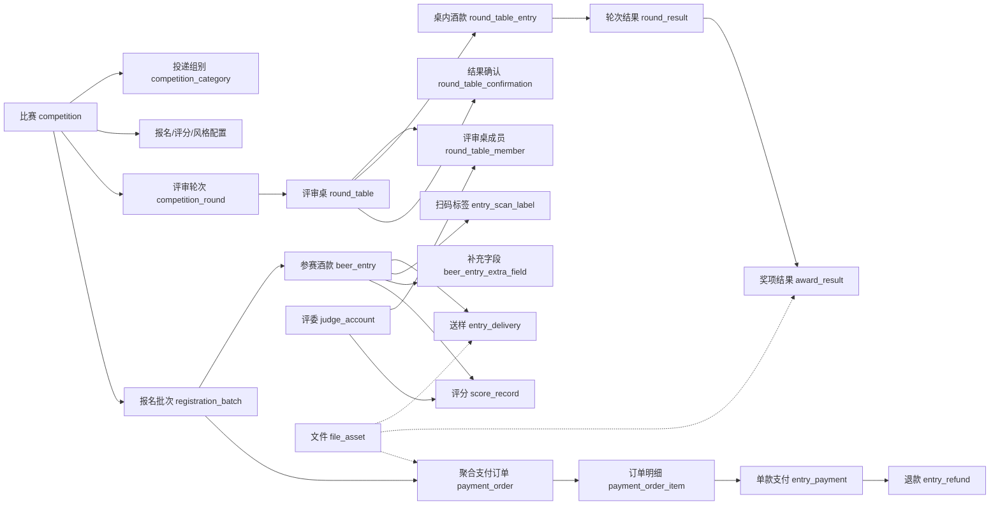

# 啤酒大赛系统数据库设计与结构解析

> 核对日期：2026-07-27。本文档基于本地 MySQL `beer_competition` 数据库的实际元数据生成，并结合项目建表脚本、增量 SQL 和后端枚举进行解析。

## 1. 文档范围与依据

- 数据库：`beer_competition`；主机 `localhost:3306`；仅读取表、字段、索引、注释和外键元数据。
- 结构基线：`beer-competition-api/src/main/resources/db/migrations/beer_competition_full.sql`。
- 增量变更：`docs/sql/` 目录下按日期命名的建表和变更脚本。
- 业务语义：`beer-competition-api/src/main/java/com/beercompetition/pojo/po` 实体类及 `pojo/enums` 枚举。
- 本文档不展开真实业务数据、手机号、微信号、支付报文等敏感内容；“当前行数”仅作为本地测试库结构核对快照，InnoDB 的 `TABLE_ROWS` 为估算值。

## 2. 总体结论

- 当前数据库包含 **40 张表、474 个字段、208 条索引列定义**。
- 所有表使用 InnoDB；当前表默认排序规则为 `utf8mb4_0900_ai_ci`，适合中英文混合业务数据。
- 当前数据库未声明外键约束（检测到 **0 条**）。表之间的关联依赖 `*_id`、公开编号和应用层事务/校验维护。
- 数据模型以自增 `BIGINT` 内部主键为主，同时为比赛、酒款、评委、支付单、报名批次和扫码标签提供公开编号或业务单号，便于接口暴露和业务追踪。
- 设计同时采用结构化列和 JSON：稳定查询条件、状态和金额放在独立列；评分维度、报名扩展字段、支付原始报文等可变结构放在 JSON 列。
- 关键流程均有状态字段：比赛、报名批次、酒款报名、支付、退款、送样、评审轮次、评审桌、奖项结果分别维护生命周期。
- 评委手机号和微信号采用密文/哈希字段设计；厂商侧 `brewery`、`portal_account` 仍保留明文字段，后续如进入生产环境应按统一隐私策略评估。

## 3. 逻辑关系总览

数据库没有物理外键，以下关系图表示业务层逻辑关系：

核心业务链路可以概括为：比赛配置 → 厂商报名批次 → 参赛酒款 → 支付/送样 → 评审编排 → 评分与晋级 → 轮次结果 → 奖项确认与发布。

## 4. 表清单与分域

| 领域 | 表名 | 中文名称 | 字段数 | 本地快照行数（估计） |
|---|---|---|---:|---:|
| 一、比赛主数据与报名配置 | `competition` | 比赛主表 | 26 | 13 |
| 一、比赛主数据与报名配置 | `competition_category` | 比赛投递组别配置表 | 5 | 37 |
| 一、比赛主数据与报名配置 | `competition_style_config` | 比赛可选基础风格配置表 | 10 | 1,111 |
| 一、比赛主数据与报名配置 | `entry_field_config` | 比赛报名补充字段配置表 | 13 | 13 |
| 一、比赛主数据与报名配置 | `competition_score_config` | 比赛评分表配置表 | 7 | 39 |
| 一、比赛主数据与报名配置 | `competition_sponsor` | 比赛赞助商配置表 | 10 | 2 |
| 一、比赛主数据与报名配置 | `award_rule` | 比赛奖项规则表 | 11 | 123 |
| 二、风格库基础数据 | `style_library` | 啤酒风格库表 | 10 | 6 |
| 二、风格库基础数据 | `style_category` | 啤酒风格分类表 | 5 | 164 |
| 二、风格库基础数据 | `style_item` | 啤酒风格条目表 | 10 | 716 |
| 三、厂商账号与参赛报名 | `brewery` | 厂牌资料表 | 9 | 69 |
| 三、厂商账号与参赛报名 | `portal_account` | 厂商端账号表 | 8 | 9 |
| 三、厂商账号与参赛报名 | `registration_batch` | 多酒款报名批次表 | 12 | 125 |
| 三、厂商账号与参赛报名 | `beer_entry` | 参赛酒款报名表 | 19 | 221 |
| 三、厂商账号与参赛报名 | `beer_entry_extra_field` | 参赛酒款补充字段值表 | 5 | 61 |
| 四、送样、文件与标签 | `entry_delivery` | 参赛酒款送样记录表 | 13 | 220 |
| 四、送样、文件与标签 | `entry_scan_label` | 参赛酒款扫码标签表 | 13 | 221 |
| 四、送样、文件与标签 | `file_asset` | 文件资产表 | 9 | 9 |
| 五、报名支付与退款 | `payment_order` | 聚合报名支付订单表 | 20 | 125 |
| 五、报名支付与退款 | `payment_order_item` | 聚合支付订单酒款明细表 | 9 | 129 |
| 五、报名支付与退款 | `entry_payment` | 参赛酒款报名支付记录表 | 21 | 221 |
| 五、报名支付与退款 | `bank_transfer_payment` | 银行转账付款单表 | 20 | 5 |
| 五、报名支付与退款 | `entry_refund` | 参赛酒款退款记录表 | 22 | 19 |
| 五、报名支付与退款 | `wechat_pay_notify` | 微信支付回调审计表 | 13 | 15 |
| 六、评委账号与评审编排 | `judge_account` | 评委账号资料表 | 17 | 29 |
| 六、评委账号与评审编排 | `competition_judge_table` | 比赛基础评审桌配置表 | 6 | 22 |
| 六、评委账号与评审编排 | `competition_judge_assignment` | 比赛基础评审桌评委分配表 | 6 | 55 |
| 六、评委账号与评审编排 | `competition_round` | 比赛评审轮次表 | 13 | 21 |
| 六、评委账号与评审编排 | `round_table` | 评审轮次桌表 | 18 | 36 |
| 六、评委账号与评审编排 | `round_table_member` | 评审桌成员表 | 5 | 81 |
| 六、评委账号与评审编排 | `round_table_entry` | 评审桌酒款分配表 | 10 | 108 |
| 六、评委账号与评审编排 | `round_table_confirmation` | 评审桌结果确认表 | 6 | 29 |
| 七、评分、结果与奖项 | `judge_score_session` | 评审评分过程会话 | 14 | 77 |
| 七、评分、结果与奖项 | `score_record` | 评委评分记录表 | 18 | 176 |
| 七、评分、结果与奖项 | `round_judge_ranking_draft` | 排序轮评委个人排序草稿表 | 8 | 5 |
| 七、评分、结果与奖项 | `round_result` | 评审轮次结果表 | 11 | 60 |
| 七、评分、结果与奖项 | `award_result` | 比赛奖项结果表 | 22 | 24 |
| 八、后台账号、审计与短信 | `admin_user` | 后台管理员账号表 | 7 | 3 |
| 八、后台账号、审计与短信 | `admin_operation_log` | 后台操作日志表 | 7 | 445 |
| 八、后台账号、审计与短信 | `sms_code_log` | 短信验证码发送记录表 | 6 | 50 |

### 分域说明

- **比赛主数据与报名配置**：比赛基本信息、组别、风格快照、动态报名字段、评分表和奖项规则。
- **风格库基础数据**：可复用的风格库、分类和风格条目；比赛报名时可复制为比赛级风格配置。
- **厂商账号与参赛报名**：厂牌、厂商账号、批量报名和具体参赛酒款。
- **送样、文件与标签**：物流提交与收样、统一文件资产、参赛酒款标签和扫码识别。
- **报名支付与退款**：批次级聚合支付、单酒款支付、银行转账、微信回调和退款。
- **评委账号与评审编排**：评委资料、基础评审桌、轮次评审桌、桌成员和酒款分配。
- **评分、结果与奖项**：评分过程、评分事实、个人排序草稿、轮次结果和正式奖项。
- **后台账号、审计与短信**：后台账号、操作审计和短信验证码发送记录。

## 5. 状态、类型与枚举约束

| 字段 | 业务含义 | 当前代码中定义的值 |
|---|---|---|
| `competition.status` | 比赛流程 | DRAFT、REGISTRATION_OPEN、REGISTRATION_CLOSED、JUDGING_PREP、JUDGING、RESULT_CONFIRMING、PUBLISHED、ARCHIVED |
| `competition.competition_type` | 比赛类型 | AWARD、FEEDBACK_ONLY |
| `competition.delivery_method` | 比赛送样方式 | EXPRESS、ONSITE、BOTH |
| `competition.logistics_visibility` | 送样信息可见范围 | PUBLIC、LOGIN_REQUIRED、PAYMENT_CONFIRMED |
| `beer_entry.status` | 报名状态 | PENDING_PAYMENT、REGISTERED、STORED、CANCELED、RESULT_PUBLISHED |
| `entry_payment.status` | 单款支付状态 | UNPAID、PENDING_CONFIRM、PAID、CANCELED、REFUNDED |
| `entry_payment.pay_method` | 支付方式 | MANUAL、MOCK、WECHAT、BANK_TRANSFER |
| `payment_order.status` | 聚合订单状态 | UNPAID、PENDING_CONFIRM、PAID、PARTIALLY_REFUNDED、REFUNDED、CANCELED |
| `registration_batch.status` | 报名批次状态 | PENDING_PAYMENT、PAID、PARTIALLY_REFUNDED、REFUNDED、CANCELED |
| `bank_transfer_payment.status` | 银行转账付款单状态 | SUBMITTED、CONFIRMED、REJECTED、CANCELED |
| `entry_refund.status` | 退款状态 | REQUESTED、APPROVED、PROCESSING、SUCCESS、FAILED、REJECTED |
| `entry_delivery.delivery_status` | 送样状态 | NOT_SUBMITTED、SUBMITTED、RECEIVED |
| `entry_scan_label.status` | 扫码标签状态 | ACTIVE、DISABLED、REGENERATED |
| `competition_round.status` | 轮次状态 | DRAFT、PUBLISHED、IN_PROGRESS、SUBMITTED、LOCKED |
| `competition_round.round_type` | 轮次类型 | SCORE、RANKING |
| `round_table_entry.status` | 评审桌内酒款状态 | ASSIGNED、ADVANCED、ELIMINATED、RANKED |
| `round_result.result_type` | 轮次结果类型 | EVALUATED、ADVANCE、RANK、AWARD_CANDIDATE、CHAMPION |
| `award_result.status` | 奖项结果状态 | DRAFT、CONFIRMED、PUBLISHED |
| `award_result.award_type` | 奖项类型 | MEDAL、CHAMPION |
| `judge_account.status` | 评委账号状态码 | 0=DISABLED、1=ACTIVE、2=PENDING_REVIEW、3=PROFILE_INCOMPLETE |

说明：部分表还存在桌状态、角色、字段类型等枚举或受业务规则约束的字符串字段。数据库层未使用 CHECK/外键完整表达这些约束，最终合法性由后端服务和状态机校验。

## 6. 逐表字段设计

### 一、比赛主数据与报名配置

#### 1. `competition` — 比赛主表

- 存储引擎：`InnoDB`；排序规则：`utf8mb4_0900_ai_ci`；字段数：26；索引数：3。
- 本地快照行数（估计）：13。
- 逻辑关联：主表；通过 competition_id 被报名批次、参赛酒款、轮次、组别、评分配置、风格配置、赞助商和奖项规则等业务表引用。

| 序号 | 字段 | 类型 | 可空 | 默认值 | 键标记 | 额外属性 | 中文说明 |
|---:|---|---|---|---|---|---|---|
| 1 | `id` | `bigint` | 否 | — | 主键 | 自增 | 主键ID |
| 2 | `code` | `varchar(64)` | 否 | — | 唯一索引 | — | 比赛编码 |
| 3 | `name` | `varchar(128)` | 否 | — | — | — | 比赛名称 |
| 4 | `competition_date` | `date` | 否 | — | — | — | 比赛日期 |
| 5 | `registration_start` | `datetime` | 是 | — | — | — | 报名开始时间 |
| 6 | `registration_deadline` | `datetime` | 否 | — | — | — | 报名截止时间 |
| 7 | `status` | `varchar(32)` | 否 | — | 普通索引 | — | 比赛流程状态 |
| 8 | `competition_type` | `varchar(32)` | 否 | AWARD | — | — | 比赛类型 |
| 9 | `entry_fee` | `decimal(10,2)` | 否 | 0.00 | — | — | 标准报名费 |
| 10 | `early_bird_fee` | `decimal(10,2)` | 是 | — | — | — | 早鸟报名费 |
| 11 | `early_bird_deadline` | `datetime` | 是 | — | — | — | 早鸟价截止时间 |
| 12 | `description` | `varchar(1000)` | 是 | — | — | — | 说明 |
| 13 | `rules_url` | `varchar(500)` | 是 | — | — | — | 参赛规则文件地址 |
| 14 | `style_library_version` | `varchar(64)` | 否 | BJCP_2021_CN | — | — | 绑定风格库版本 |
| 15 | `delivery_method` | `varchar(32)` | 否 | BOTH | — | — | 支持的送样方式 |
| 16 | `sample_arrival_start` | `datetime` | 是 | — | — | — | 收样开始时间 |
| 17 | `sample_arrival_deadline` | `datetime` | 是 | — | — | — | 收样截止时间 |
| 18 | `sample_quantity_note` | `varchar(255)` | 是 | — | — | — | 送样数量说明 |
| 19 | `delivery_recipient` | `varchar(64)` | 是 | — | — | — | 收样联系人 |
| 20 | `delivery_phone` | `varchar(64)` | 是 | — | — | — | 收样联系电话 |
| 21 | `delivery_address` | `varchar(500)` | 是 | — | — | — | 收样地址 |
| 22 | `delivery_note` | `varchar(1000)` | 是 | — | — | — | 送样补充说明 |
| 23 | `logistics_visibility` | `varchar(32)` | 否 | PAYMENT_CONFIRMED | — | — | 送样信息可见范围 |
| 24 | `deleted_flag` | `tinyint` | 否 | 0 | — | — | 是否删除 |
| 25 | `create_time` | `datetime` | 否 | CURRENT_TIMESTAMP | — | 数据库生成默认值 | 创建时间 |
| 26 | `update_time` | `datetime` | 否 | CURRENT_TIMESTAMP | — | 数据库生成默认值 更新时自动刷新时间戳 | 更新时间 |

**索引定义**

| 索引名 | 类型 | 索引字段（顺序） | 索引算法 |
|---|---|---|---|
| `idx_competition_status_registration_deadline` | 普通索引 | `status`, `registration_deadline` | `BTREE` |
| `PRIMARY` | 主键 | `id` | `BTREE` |
| `uk_competition_code` | 唯一索引 | `code` | `BTREE` |

#### 2. `competition_category` — 比赛投递组别配置表

- 存储引擎：`InnoDB`；排序规则：`utf8mb4_0900_ai_ci`；字段数：5；索引数：2。
- 本地快照行数（估计）：37。
- 逻辑关联：通过表内的 `*_id`、公开编号或业务单号与其他业务表建立逻辑关联；当前数据库未声明物理外键。

| 序号 | 字段 | 类型 | 可空 | 默认值 | 键标记 | 额外属性 | 中文说明 |
|---:|---|---|---|---|---|---|---|
| 1 | `id` | `bigint` | 否 | — | 主键 | 自增 | 主键ID |
| 2 | `competition_id` | `bigint` | 否 | — | 普通索引 | — | 所属比赛ID |
| 3 | `name` | `varchar(128)` | 否 | — | — | — | 投递组别名称 |
| 4 | `sort_order` | `int` | 否 | 0 | — | — | 展示排序 |
| 5 | `create_time` | `datetime` | 否 | CURRENT_TIMESTAMP | — | 数据库生成默认值 | 创建时间 |

**索引定义**

| 索引名 | 类型 | 索引字段（顺序） | 索引算法 |
|---|---|---|---|
| `PRIMARY` | 主键 | `id` | `BTREE` |
| `uk_competition_category_name` | 唯一索引 | `competition_id`, `name` | `BTREE` |

#### 3. `competition_style_config` — 比赛可选基础风格配置表

- 存储引擎：`InnoDB`；排序规则：`utf8mb4_0900_ai_ci`；字段数：10；索引数：3。
- 本地快照行数（估计）：1,111。
- 逻辑关联：通过表内的 `*_id`、公开编号或业务单号与其他业务表建立逻辑关联；当前数据库未声明物理外键。

| 序号 | 字段 | 类型 | 可空 | 默认值 | 键标记 | 额外属性 | 中文说明 |
|---:|---|---|---|---|---|---|---|
| 1 | `id` | `bigint` | 否 | — | 主键 | 自增 | 主键ID |
| 2 | `competition_id` | `bigint` | 否 | — | 普通索引 | — | 所属比赛ID |
| 3 | `name` | `varchar(128)` | 否 | — | — | — | 风格名称 |
| 4 | `category_name` | `varchar(128)` | 是 | — | — | — | 风格分类名称 |
| 5 | `style_code` | `varchar(64)` | 是 | — | — | — | 风格编码 |
| 6 | `description` | `text` | 是 | — | — | — | 说明 |
| 7 | `sort_order` | `int` | 否 | 0 | — | — | 展示排序 |
| 8 | `active_flag` | `tinyint` | 否 | 1 | — | — | 是否为当前可报名风格 |
| 9 | `source_library_version` | `varchar(64)` | 是 | — | — | — | 来源风格库版本 |
| 10 | `create_time` | `datetime` | 否 | CURRENT_TIMESTAMP | — | 数据库生成默认值 | 创建时间 |

**索引定义**

| 索引名 | 类型 | 索引字段（顺序） | 索引算法 |
|---|---|---|---|
| `idx_competition_style_active` | 普通索引 | `competition_id`, `active_flag`, `sort_order` | `BTREE` |
| `idx_competition_style_name` | 普通索引 | `competition_id`, `name` | `BTREE` |
| `PRIMARY` | 主键 | `id` | `BTREE` |

#### 4. `entry_field_config` — 比赛报名补充字段配置表

- 存储引擎：`InnoDB`；排序规则：`utf8mb4_0900_ai_ci`；字段数：13；索引数：3。
- 本地快照行数（估计）：13。
- 逻辑关联：通过表内的 `*_id`、公开编号或业务单号与其他业务表建立逻辑关联；当前数据库未声明物理外键。

| 序号 | 字段 | 类型 | 可空 | 默认值 | 键标记 | 额外属性 | 中文说明 |
|---:|---|---|---|---|---|---|---|
| 1 | `id` | `bigint` | 否 | — | 主键 | 自增 | 主键ID |
| 2 | `competition_id` | `bigint` | 否 | — | 普通索引 | — | 所属比赛ID |
| 3 | `field_key` | `varchar(64)` | 否 | — | — | — | 字段Key |
| 4 | `field_label` | `varchar(64)` | 否 | — | — | — | 字段名称 |
| 5 | `field_type` | `varchar(32)` | 否 | — | — | — | 字段类型 |
| 6 | `help_text` | `varchar(255)` | 是 | — | — | — | 填写提示文案 |
| 7 | `options_json` | `json` | 是 | — | — | — | 选项JSON |
| 8 | `required_flag` | `tinyint` | 否 | 0 | — | — | 是否必填 |
| 9 | `visible_to_judges` | `tinyint` | 否 | 0 | — | — | 是否对评审可见 |
| 10 | `sort_order` | `int` | 否 | 0 | — | — | 展示排序 |
| 11 | `active_flag` | `tinyint` | 否 | 1 | — | — | 是否为当前报名字段 |
| 12 | `create_time` | `datetime` | 否 | CURRENT_TIMESTAMP | — | 数据库生成默认值 | 创建时间 |
| 13 | `update_time` | `datetime` | 否 | CURRENT_TIMESTAMP | — | 数据库生成默认值 更新时自动刷新时间戳 | 更新时间 |

**索引定义**

| 索引名 | 类型 | 索引字段（顺序） | 索引算法 |
|---|---|---|---|
| `idx_entry_field_active` | 普通索引 | `competition_id`, `active_flag`, `sort_order` | `BTREE` |
| `PRIMARY` | 主键 | `id` | `BTREE` |
| `uk_entry_field_config_key` | 唯一索引 | `competition_id`, `field_key` | `BTREE` |

#### 5. `competition_score_config` — 比赛评分表配置表

- 存储引擎：`InnoDB`；排序规则：`utf8mb4_0900_ai_ci`；字段数：7；索引数：2。
- 本地快照行数（估计）：39。
- 逻辑关联：通过表内的 `*_id`、公开编号或业务单号与其他业务表建立逻辑关联；当前数据库未声明物理外键。

| 序号 | 字段 | 类型 | 可空 | 默认值 | 键标记 | 额外属性 | 中文说明 |
|---:|---|---|---|---|---|---|---|
| 1 | `id` | `bigint` | 否 | — | 主键 | 自增 | 主键ID |
| 2 | `competition_id` | `bigint` | 否 | — | 普通索引 | — | 所属比赛ID |
| 3 | `judge_role_type` | `varchar(32)` | 否 | — | — | — | 评委角色类型 |
| 4 | `min_comment_length` | `int` | 否 | 0 | — | — | 评语最小字数 |
| 5 | `dimensions_json` | `json` | 否 | — | — | — | 评分维度JSON |
| 6 | `create_time` | `datetime` | 否 | CURRENT_TIMESTAMP | — | 数据库生成默认值 | 创建时间 |
| 7 | `update_time` | `datetime` | 否 | CURRENT_TIMESTAMP | — | 数据库生成默认值 更新时自动刷新时间戳 | 更新时间 |

**索引定义**

| 索引名 | 类型 | 索引字段（顺序） | 索引算法 |
|---|---|---|---|
| `PRIMARY` | 主键 | `id` | `BTREE` |
| `uk_competition_score_config` | 唯一索引 | `competition_id`, `judge_role_type` | `BTREE` |

#### 6. `competition_sponsor` — 比赛赞助商配置表

- 存储引擎：`InnoDB`；排序规则：`utf8mb4_0900_ai_ci`；字段数：10；索引数：3。
- 本地快照行数（估计）：2。
- 逻辑关联：通过表内的 `*_id`、公开编号或业务单号与其他业务表建立逻辑关联；当前数据库未声明物理外键。

| 序号 | 字段 | 类型 | 可空 | 默认值 | 键标记 | 额外属性 | 中文说明 |
|---:|---|---|---|---|---|---|---|
| 1 | `id` | `bigint` | 否 | — | 主键 | 自增 | 主键ID |
| 2 | `competition_id` | `bigint` | 否 | — | 普通索引 | — | 所属比赛ID |
| 3 | `tier_label` | `varchar(32)` | 否 | — | — | — | 赞助等级 |
| 4 | `sponsor_name` | `varchar(64)` | 否 | — | — | — | 赞助商名称 |
| 5 | `logo_asset_id` | `bigint` | 是 | — | 普通索引 | — | Logo 文件资产ID |
| 6 | `sort_order` | `int` | 否 | 0 | — | — | 展示排序 |
| 7 | `featured_flag` | `tinyint` | 否 | 0 | — | — | 是否重点展示 |
| 8 | `enabled_flag` | `tinyint` | 否 | 1 | — | — | 是否启用 |
| 9 | `create_time` | `datetime` | 否 | CURRENT_TIMESTAMP | — | 数据库生成默认值 | 创建时间 |
| 10 | `update_time` | `datetime` | 否 | CURRENT_TIMESTAMP | — | 数据库生成默认值 更新时自动刷新时间戳 | 更新时间 |

**索引定义**

| 索引名 | 类型 | 索引字段（顺序） | 索引算法 |
|---|---|---|---|
| `idx_competition_sponsor_competition` | 普通索引 | `competition_id`, `enabled_flag`, `sort_order` | `BTREE` |
| `idx_competition_sponsor_logo` | 普通索引 | `logo_asset_id` | `BTREE` |
| `PRIMARY` | 主键 | `id` | `BTREE` |

#### 7. `award_rule` — 比赛奖项规则表

- 存储引擎：`InnoDB`；排序规则：`utf8mb4_0900_ai_ci`；字段数：11；索引数：4。
- 本地快照行数（估计）：123。
- 逻辑关联：通过表内的 `*_id`、公开编号或业务单号与其他业务表建立逻辑关联；当前数据库未声明物理外键。

| 序号 | 字段 | 类型 | 可空 | 默认值 | 键标记 | 额外属性 | 中文说明 |
|---:|---|---|---|---|---|---|---|
| 1 | `id` | `bigint` | 否 | — | 主键 | 自增 | 主键ID |
| 2 | `competition_id` | `bigint` | 否 | — | 普通索引 | — | 所属比赛ID |
| 3 | `category_id` | `bigint` | 是 | — | 普通索引 | — | 投递组别ID |
| 4 | `category_key` | `bigint` | 是 | — | — | 存储生成列 | 用于同一奖项规则唯一约束的组别键 |
| 5 | `award_type` | `varchar(32)` | 否 | — | — | — | 奖项类型 |
| 6 | `award_name` | `varchar(64)` | 否 | — | — | — | 奖项名称 |
| 7 | `rank_no` | `int` | 是 | — | — | — | 名次 |
| 8 | `enabled_flag` | `tinyint` | 否 | 1 | — | — | 是否启用 |
| 9 | `sort_order` | `int` | 否 | 0 | — | — | 展示排序 |
| 10 | `create_time` | `datetime` | 否 | CURRENT_TIMESTAMP | — | 数据库生成默认值 | 创建时间 |
| 11 | `update_time` | `datetime` | 否 | CURRENT_TIMESTAMP | — | 数据库生成默认值 更新时自动刷新时间戳 | 更新时间 |

**索引定义**

| 索引名 | 类型 | 索引字段（顺序） | 索引算法 |
|---|---|---|---|
| `idx_award_rule_category` | 普通索引 | `category_id` | `BTREE` |
| `idx_award_rule_competition` | 普通索引 | `competition_id` | `BTREE` |
| `PRIMARY` | 主键 | `id` | `BTREE` |
| `uk_award_rule_slot` | 唯一索引 | `competition_id`, `category_key`, `award_type`, `rank_no` | `BTREE` |

### 二、风格库基础数据

#### 8. `style_library` — 啤酒风格库表

- 存储引擎：`InnoDB`；排序规则：`utf8mb4_0900_ai_ci`；字段数：10；索引数：2。
- 本地快照行数（估计）：6。
- 逻辑关联：风格库根实体；下接 style_category 和 style_item，比赛通过版本号或快照配置使用。

| 序号 | 字段 | 类型 | 可空 | 默认值 | 键标记 | 额外属性 | 中文说明 |
|---:|---|---|---|---|---|---|---|
| 1 | `id` | `bigint` | 否 | — | 主键 | 自增 | 主键ID |
| 2 | `code` | `varchar(64)` | 否 | — | 唯一索引 | — | 风格库编码 |
| 3 | `name` | `varchar(128)` | 否 | — | — | — | 风格库名称 |
| 4 | `version` | `varchar(64)` | 否 | — | — | — | 风格库版本 |
| 5 | `language` | `varchar(32)` | 否 | — | — | — | 语言 |
| 6 | `source` | `varchar(64)` | 否 | — | — | — | 来源 |
| 7 | `status` | `tinyint` | 否 | 1 | — | — | 风格库启用状态 |
| 8 | `tags_json` | `json` | 是 | — | — | — | 标签JSON |
| 9 | `create_time` | `datetime` | 否 | CURRENT_TIMESTAMP | — | 数据库生成默认值 | 创建时间 |
| 10 | `update_time` | `datetime` | 否 | CURRENT_TIMESTAMP | — | 数据库生成默认值 更新时自动刷新时间戳 | 更新时间 |

**索引定义**

| 索引名 | 类型 | 索引字段（顺序） | 索引算法 |
|---|---|---|---|
| `PRIMARY` | 主键 | `id` | `BTREE` |
| `uk_style_library_code` | 唯一索引 | `code` | `BTREE` |

#### 9. `style_category` — 啤酒风格分类表

- 存储引擎：`InnoDB`；排序规则：`utf8mb4_0900_ai_ci`；字段数：5；索引数：3。
- 本地快照行数（估计）：164。
- 逻辑关联：通过表内的 `*_id`、公开编号或业务单号与其他业务表建立逻辑关联；当前数据库未声明物理外键。

| 序号 | 字段 | 类型 | 可空 | 默认值 | 键标记 | 额外属性 | 中文说明 |
|---:|---|---|---|---|---|---|---|
| 1 | `id` | `bigint` | 否 | — | 主键 | 自增 | 主键ID |
| 2 | `library_id` | `bigint` | 否 | — | 普通索引 | — | 所属风格库ID |
| 3 | `name` | `varchar(128)` | 否 | — | — | — | 风格分类名称 |
| 4 | `sort_order` | `int` | 否 | 0 | — | — | 展示排序 |
| 5 | `create_time` | `datetime` | 否 | CURRENT_TIMESTAMP | — | 数据库生成默认值 | 创建时间 |

**索引定义**

| 索引名 | 类型 | 索引字段（顺序） | 索引算法 |
|---|---|---|---|
| `idx_style_category_library` | 普通索引 | `library_id`, `sort_order` | `BTREE` |
| `PRIMARY` | 主键 | `id` | `BTREE` |
| `uk_style_category_name` | 唯一索引 | `library_id`, `name` | `BTREE` |

#### 10. `style_item` — 啤酒风格条目表

- 存储引擎：`InnoDB`；排序规则：`utf8mb4_0900_ai_ci`；字段数：10；索引数：4。
- 本地快照行数（估计）：716。
- 逻辑关联：通过表内的 `*_id`、公开编号或业务单号与其他业务表建立逻辑关联；当前数据库未声明物理外键。

| 序号 | 字段 | 类型 | 可空 | 默认值 | 键标记 | 额外属性 | 中文说明 |
|---:|---|---|---|---|---|---|---|
| 1 | `id` | `bigint` | 否 | — | 主键 | 自增 | 主键ID |
| 2 | `library_id` | `bigint` | 否 | — | 普通索引 | — | 所属风格库ID |
| 3 | `category_id` | `bigint` | 是 | — | 普通索引 | — | 风格分类ID |
| 4 | `name` | `varchar(128)` | 否 | — | — | — | 风格名称 |
| 5 | `style_code` | `varchar(64)` | 是 | — | — | — | 风格编码 |
| 6 | `description` | `text` | 是 | — | — | — | 说明 |
| 7 | `status` | `tinyint` | 否 | 1 | — | — | 风格启用状态 |
| 8 | `sort_order` | `int` | 否 | 0 | — | — | 展示排序 |
| 9 | `create_time` | `datetime` | 否 | CURRENT_TIMESTAMP | — | 数据库生成默认值 | 创建时间 |
| 10 | `update_time` | `datetime` | 否 | CURRENT_TIMESTAMP | — | 数据库生成默认值 更新时自动刷新时间戳 | 更新时间 |

**索引定义**

| 索引名 | 类型 | 索引字段（顺序） | 索引算法 |
|---|---|---|---|
| `idx_style_item_category` | 普通索引 | `category_id`, `sort_order` | `BTREE` |
| `idx_style_item_library` | 普通索引 | `library_id`, `sort_order` | `BTREE` |
| `PRIMARY` | 主键 | `id` | `BTREE` |
| `uk_style_item_name` | 唯一索引 | `library_id`, `name` | `BTREE` |

### 三、厂商账号与参赛报名

#### 11. `brewery` — 厂牌资料表

- 存储引擎：`InnoDB`；排序规则：`utf8mb4_0900_ai_ci`；字段数：9；索引数：1。
- 本地快照行数（估计）：69。
- 逻辑关联：厂牌主资料；与 portal_account、registration_batch、beer_entry、bank_transfer_payment 形成厂商侧业务链。

| 序号 | 字段 | 类型 | 可空 | 默认值 | 键标记 | 额外属性 | 中文说明 |
|---:|---|---|---|---|---|---|---|
| 1 | `id` | `bigint` | 否 | — | 主键 | 自增 | 主键ID |
| 2 | `company_name` | `varchar(128)` | 否 | — | — | — | 厂牌或公司名称 |
| 3 | `contact_name` | `varchar(64)` | 否 | — | — | — | 联系人姓名 |
| 4 | `phone` | `varchar(20)` | 否 | — | — | — | 手机号 |
| 5 | `wechat` | `varchar(64)` | 是 | — | — | — | 微信号 |
| 6 | `avatar_asset_id` | `bigint` | 是 | — | — | — | 头像文件ID |
| 7 | `avatar_url` | `varchar(500)` | 是 | — | — | — | 厂牌头像访问地址 |
| 8 | `create_time` | `datetime` | 否 | CURRENT_TIMESTAMP | — | 数据库生成默认值 | 创建时间 |
| 9 | `update_time` | `datetime` | 否 | CURRENT_TIMESTAMP | — | 数据库生成默认值 更新时自动刷新时间戳 | 更新时间 |

**索引定义**

| 索引名 | 类型 | 索引字段（顺序） | 索引算法 |
|---|---|---|---|
| `PRIMARY` | 主键 | `id` | `BTREE` |

#### 12. `portal_account` — 厂商端账号表

- 存储引擎：`InnoDB`；排序规则：`utf8mb4_0900_ai_ci`；字段数：8；索引数：3。
- 本地快照行数（估计）：9。
- 逻辑关联：厂商端登录账号；通过 brewery_id 归属厂牌，提交报名批次并申请退款。

| 序号 | 字段 | 类型 | 可空 | 默认值 | 键标记 | 额外属性 | 中文说明 |
|---:|---|---|---|---|---|---|---|
| 1 | `id` | `bigint` | 否 | — | 主键 | 自增 | 主键ID |
| 2 | `phone` | `varchar(20)` | 否 | — | 唯一索引 | — | 手机号 |
| 3 | `wechat` | `varchar(64)` | 是 | — | — | — | 微信号 |
| 4 | `display_name` | `varchar(64)` | 否 | — | — | — | 显示名称 |
| 5 | `brewery_id` | `bigint` | 否 | — | 普通索引 | — | 厂牌ID |
| 6 | `status` | `tinyint` | 否 | 1 | — | — | 账号状态 |
| 7 | `create_time` | `datetime` | 否 | CURRENT_TIMESTAMP | — | 数据库生成默认值 | 创建时间 |
| 8 | `update_time` | `datetime` | 否 | CURRENT_TIMESTAMP | — | 数据库生成默认值 更新时自动刷新时间戳 | 更新时间 |

**索引定义**

| 索引名 | 类型 | 索引字段（顺序） | 索引算法 |
|---|---|---|---|
| `idx_portal_account_brewery` | 普通索引 | `brewery_id` | `BTREE` |
| `PRIMARY` | 主键 | `id` | `BTREE` |
| `uk_portal_account_phone` | 唯一索引 | `phone` | `BTREE` |

#### 13. `registration_batch` — 多酒款报名批次表

- 存储引擎：`InnoDB`；排序规则：`utf8mb4_0900_ai_ci`；字段数：12；索引数：5。
- 本地快照行数（估计）：125。
- 逻辑关联：一次多酒款报名的聚合根；向下关联多个 beer_entry，并由 payment_order 聚合支付。

| 序号 | 字段 | 类型 | 可空 | 默认值 | 键标记 | 额外属性 | 中文说明 |
|---:|---|---|---|---|---|---|---|
| 1 | `id` | `bigint` | 否 | — | 主键 | 自增 | 主键ID |
| 2 | `batch_no` | `varchar(64)` | 否 | — | 唯一索引 | — | 报名批次号 |
| 3 | `competition_id` | `bigint` | 否 | — | 普通索引 | — | 所属比赛ID |
| 4 | `brewery_id` | `bigint` | 否 | — | 普通索引 | — | 厂牌ID |
| 5 | `portal_account_id` | `bigint` | 否 | — | 普通索引 | — | 提交账号ID |
| 6 | `entry_count` | `int` | 否 | — | — | — | 酒款数量 |
| 7 | `total_amount` | `decimal(10,2)` | 否 | — | — | — | 批次应付总额 |
| 8 | `status` | `varchar(32)` | 否 | — | — | — | 批次状态 |
| 9 | `idempotency_key` | `varchar(64)` | 否 | — | — | — | 客户端幂等键 |
| 10 | `rules_accepted` | `tinyint` | 否 | 0 | — | — | 是否同意参赛细则 |
| 11 | `create_time` | `datetime` | 否 | CURRENT_TIMESTAMP | — | 数据库生成默认值 | 创建时间 |
| 12 | `update_time` | `datetime` | 否 | CURRENT_TIMESTAMP | — | 数据库生成默认值 更新时自动刷新时间戳 | 更新时间 |

**索引定义**

| 索引名 | 类型 | 索引字段（顺序） | 索引算法 |
|---|---|---|---|
| `idx_registration_batch_brewery` | 普通索引 | `brewery_id`, `create_time` | `BTREE` |
| `idx_registration_batch_competition` | 普通索引 | `competition_id`, `status` | `BTREE` |
| `PRIMARY` | 主键 | `id` | `BTREE` |
| `uk_registration_batch_idempotency` | 唯一索引 | `portal_account_id`, `idempotency_key` | `BTREE` |
| `uk_registration_batch_no` | 唯一索引 | `batch_no` | `BTREE` |

#### 14. `beer_entry` — 参赛酒款报名表

- 存储引擎：`InnoDB`；排序规则：`utf8mb4_0900_ai_ci`；字段数：19；索引数：6。
- 本地快照行数（估计）：221。
- 逻辑关联：核心参赛酒款实体；向下关联送样、支付、退款、扫码标签、补充字段、评审分配、评分和结果。

| 序号 | 字段 | 类型 | 可空 | 默认值 | 键标记 | 额外属性 | 中文说明 |
|---:|---|---|---|---|---|---|---|
| 1 | `id` | `bigint` | 否 | — | 主键 | 自增 | 主键ID |
| 2 | `uuid` | `varchar(64)` | 否 | — | 唯一索引 | — | 参赛酒款公开编号 |
| 3 | `competition_id` | `bigint` | 否 | — | 普通索引 | — | 所属比赛ID |
| 4 | `brewery_id` | `bigint` | 否 | — | — | — | 厂牌ID |
| 5 | `registration_batch_id` | `bigint` | 是 | — | 普通索引 | — | 报名批次ID |
| 6 | `category_id` | `bigint` | 否 | — | — | — | 投递组别ID |
| 7 | `name` | `varchar(128)` | 否 | — | — | — | 参赛酒款名称 |
| 8 | `style` | `varchar(128)` | 否 | — | — | — | 报名选择的基础风格 |
| 9 | `style_config_id` | `bigint` | 是 | — | — | — | 报名时选择的比赛风格快照ID |
| 10 | `abv` | `decimal(4,2)` | 否 | — | — | — | 酒精度ABV |
| 11 | `extra_fields_json` | `json` | 是 | — | — | — | 补充报名字段快照JSON |
| 12 | `status` | `varchar(32)` | 否 | — | — | — | 酒款报名状态 |
| 13 | `stored_flag` | `tinyint` | 否 | 0 | — | — | 是否已入库 |
| 14 | `deleted_flag` | `tinyint` | 否 | 0 | 普通索引 | — | 管理端业务删除标记 |
| 15 | `deleted_time` | `datetime` | 是 | — | — | — | 管理端删除时间 |
| 16 | `deleted_by_admin_id` | `bigint` | 是 | — | — | — | 执行删除的管理员ID |
| 17 | `delete_reason` | `varchar(500)` | 是 | — | — | — | 管理端删除原因 |
| 18 | `create_time` | `datetime` | 否 | CURRENT_TIMESTAMP | — | 数据库生成默认值 | 创建时间 |
| 19 | `update_time` | `datetime` | 否 | CURRENT_TIMESTAMP | — | 数据库生成默认值 更新时自动刷新时间戳 | 更新时间 |

**索引定义**

| 索引名 | 类型 | 索引字段（顺序） | 索引算法 |
|---|---|---|---|
| `idx_beer_entry_active_brewery` | 普通索引 | `deleted_flag`, `brewery_id`, `id` | `BTREE` |
| `idx_beer_entry_active_competition` | 普通索引 | `deleted_flag`, `competition_id`, `status` | `BTREE` |
| `idx_beer_entry_batch` | 普通索引 | `registration_batch_id` | `BTREE` |
| `idx_beer_entry_competition_status_stored` | 普通索引 | `competition_id`, `status`, `stored_flag` | `BTREE` |
| `PRIMARY` | 主键 | `id` | `BTREE` |
| `uk_beer_entry_uuid` | 唯一索引 | `uuid` | `BTREE` |

#### 15. `beer_entry_extra_field` — 参赛酒款补充字段值表

- 存储引擎：`InnoDB`；排序规则：`utf8mb4_0900_ai_ci`；字段数：5；索引数：1。
- 本地快照行数（估计）：61。
- 逻辑关联：通过表内的 `*_id`、公开编号或业务单号与其他业务表建立逻辑关联；当前数据库未声明物理外键。

| 序号 | 字段 | 类型 | 可空 | 默认值 | 键标记 | 额外属性 | 中文说明 |
|---:|---|---|---|---|---|---|---|
| 1 | `id` | `bigint` | 否 | — | 主键 | 自增 | 主键ID |
| 2 | `beer_entry_id` | `bigint` | 否 | — | — | — | 参赛酒款ID |
| 3 | `field_key` | `varchar(64)` | 否 | — | — | — | 补充字段Key |
| 4 | `field_label` | `varchar(64)` | 否 | — | — | — | 补充字段名称快照 |
| 5 | `field_value` | `varchar(255)` | 否 | — | — | — | 补充字段填写值 |

**索引定义**

| 索引名 | 类型 | 索引字段（顺序） | 索引算法 |
|---|---|---|---|
| `PRIMARY` | 主键 | `id` | `BTREE` |

### 四、送样、文件与标签

#### 16. `entry_delivery` — 参赛酒款送样记录表

- 存储引擎：`InnoDB`；排序规则：`utf8mb4_0900_ai_ci`；字段数：13；索引数：2。
- 本地快照行数（估计）：220。
- 逻辑关联：通过表内的 `*_id`、公开编号或业务单号与其他业务表建立逻辑关联；当前数据库未声明物理外键。

| 序号 | 字段 | 类型 | 可空 | 默认值 | 键标记 | 额外属性 | 中文说明 |
|---:|---|---|---|---|---|---|---|
| 1 | `id` | `bigint` | 否 | — | 主键 | 自增 | 主键ID |
| 2 | `beer_entry_id` | `bigint` | 否 | — | 唯一索引 | — | 参赛酒款ID |
| 3 | `delivery_method` | `varchar(32)` | 是 | — | — | — | 送样方式 |
| 4 | `carrier` | `varchar(64)` | 是 | — | — | — | 快递公司 |
| 5 | `tracking_no` | `varchar(64)` | 是 | — | — | — | 快递单号 |
| 6 | `delivery_note` | `varchar(500)` | 是 | — | — | — | 厂商送样备注 |
| 7 | `delivery_status` | `varchar(32)` | 否 | — | — | — | 送样状态 |
| 8 | `submitted_time` | `datetime` | 是 | — | — | — | 提交时间 |
| 9 | `received_time` | `datetime` | 是 | — | — | — | 收样确认时间 |
| 10 | `received_by_admin_id` | `bigint` | 是 | — | — | — | 收样确认管理员ID |
| 11 | `receive_remark` | `varchar(255)` | 是 | — | — | — | 收样确认备注 |
| 12 | `create_time` | `datetime` | 否 | CURRENT_TIMESTAMP | — | 数据库生成默认值 | 创建时间 |
| 13 | `update_time` | `datetime` | 否 | CURRENT_TIMESTAMP | — | 数据库生成默认值 更新时自动刷新时间戳 | 更新时间 |

**索引定义**

| 索引名 | 类型 | 索引字段（顺序） | 索引算法 |
|---|---|---|---|
| `PRIMARY` | 主键 | `id` | `BTREE` |
| `uk_entry_delivery_entry` | 唯一索引 | `beer_entry_id` | `BTREE` |

#### 17. `entry_scan_label` — 参赛酒款扫码标签表

- 存储引擎：`InnoDB`；排序规则：`utf8mb4_0900_ai_ci`；字段数：13；索引数：6。
- 本地快照行数（估计）：221。
- 逻辑关联：通过表内的 `*_id`、公开编号或业务单号与其他业务表建立逻辑关联；当前数据库未声明物理外键。

| 序号 | 字段 | 类型 | 可空 | 默认值 | 键标记 | 额外属性 | 中文说明 |
|---:|---|---|---|---|---|---|---|
| 1 | `id` | `bigint` | 否 | — | 主键 | 自增 | 主键ID |
| 2 | `competition_id` | `bigint` | 否 | — | 普通索引 | — | 所属比赛ID |
| 3 | `beer_entry_id` | `bigint` | 否 | — | 普通索引 | — | 参赛酒款ID |
| 4 | `label_code` | `varchar(64)` | 否 | — | 唯一索引 | — | 完整标签编码 |
| 5 | `short_code` | `varchar(16)` | 否 | — | 唯一索引 | — | 评审短编号 |
| 6 | `scan_token` | `varchar(64)` | 否 | — | 唯一索引 | — | 扫码识别Token |
| 7 | `status` | `varchar(32)` | 否 | — | — | — | 标签状态 |
| 8 | `generated_by` | `bigint` | 是 | — | — | — | 生成标签的管理员ID |
| 9 | `generated_time` | `datetime` | 否 | CURRENT_TIMESTAMP | — | 数据库生成默认值 | 生成时间 |
| 10 | `printed_time` | `datetime` | 是 | — | — | — | 打印时间 |
| 11 | `create_time` | `datetime` | 否 | CURRENT_TIMESTAMP | — | 数据库生成默认值 | 创建时间 |
| 12 | `update_time` | `datetime` | 否 | CURRENT_TIMESTAMP | — | 数据库生成默认值 更新时自动刷新时间戳 | 更新时间 |
| 13 | `active_flag` | `tinyint` | 是 | — | — | 虚拟生成列 | 有效标签虚拟标记 |

**索引定义**

| 索引名 | 类型 | 索引字段（顺序） | 索引算法 |
|---|---|---|---|
| `idx_entry_scan_label_competition` | 普通索引 | `competition_id` | `BTREE` |
| `PRIMARY` | 主键 | `id` | `BTREE` |
| `uk_entry_scan_label_active_entry` | 唯一索引 | `beer_entry_id`, `active_flag` | `BTREE` |
| `uk_entry_scan_label_label_code` | 唯一索引 | `label_code` | `BTREE` |
| `uk_entry_scan_label_short_code` | 唯一索引 | `short_code` | `BTREE` |
| `uk_entry_scan_label_token` | 唯一索引 | `scan_token` | `BTREE` |

#### 18. `file_asset` — 文件资产表

- 存储引擎：`InnoDB`；排序规则：`utf8mb4_0900_ai_ci`；字段数：9；索引数：2。
- 本地快照行数（估计）：9。
- 逻辑关联：统一文件资产表；由业务类型、归属类型和归属ID实现多业务文件挂接。

| 序号 | 字段 | 类型 | 可空 | 默认值 | 键标记 | 额外属性 | 中文说明 |
|---:|---|---|---|---|---|---|---|
| 1 | `id` | `bigint` | 否 | — | 主键 | 自增 | 主键ID |
| 2 | `business_type` | `varchar(64)` | 否 | — | — | — | 文件业务类型 |
| 3 | `owner_type` | `varchar(32)` | 是 | — | 普通索引 | — | 归属对象类型 |
| 4 | `owner_id` | `bigint` | 是 | — | — | — | 归属对象ID |
| 5 | `storage_provider` | `varchar(32)` | 否 | — | — | — | 存储服务提供方 |
| 6 | `file_name` | `varchar(255)` | 否 | — | — | — | 原始文件名 |
| 7 | `storage_path` | `varchar(255)` | 否 | — | — | — | 存储路径 |
| 8 | `public_url` | `varchar(500)` | 是 | — | — | — | 公开访问地址 |
| 9 | `create_time` | `datetime` | 否 | CURRENT_TIMESTAMP | — | 数据库生成默认值 | 创建时间 |

**索引定义**

| 索引名 | 类型 | 索引字段（顺序） | 索引算法 |
|---|---|---|---|
| `idx_file_asset_owner` | 普通索引 | `owner_type`, `owner_id` | `BTREE` |
| `PRIMARY` | 主键 | `id` | `BTREE` |

### 五、报名支付与退款

#### 19. `payment_order` — 聚合报名支付订单表

- 存储引擎：`InnoDB`；排序规则：`utf8mb4_0900_ai_ci`；字段数：20；索引数：6。
- 本地快照行数（估计）：125。
- 逻辑关联：批次级聚合支付订单；通过 payment_order_item 分摊到具体酒款，再连接 entry_payment。

| 序号 | 字段 | 类型 | 可空 | 默认值 | 键标记 | 额外属性 | 中文说明 |
|---:|---|---|---|---|---|---|---|
| 1 | `id` | `bigint` | 否 | — | 主键 | 自增 | 主键ID |
| 2 | `order_no` | `varchar(64)` | 否 | — | 唯一索引 | — | 系统支付订单号 |
| 3 | `registration_batch_id` | `bigint` | 否 | — | 唯一索引 | — | 报名批次ID |
| 4 | `amount` | `decimal(10,2)` | 否 | — | — | — | 订单应付总额 |
| 5 | `paid_amount` | `decimal(10,2)` | 是 | — | — | — | 实付金额 |
| 6 | `refunded_amount` | `decimal(10,2)` | 否 | 0.00 | — | — | 累计退款金额 |
| 7 | `status` | `varchar(32)` | 否 | — | 普通索引 | — | 订单状态 |
| 8 | `pay_method` | `varchar(32)` | 否 | — | — | — | 支付方式 |
| 9 | `out_trade_no` | `varchar(64)` | 是 | — | 唯一索引 | — | 微信商户支付单号 |
| 10 | `wechat_transaction_id` | `varchar(64)` | 是 | — | — | — | 微信支付交易号 |
| 11 | `bank_transfer_id` | `bigint` | 是 | — | 普通索引 | — | 银行转账付款单ID |
| 12 | `code_url` | `varchar(512)` | 是 | — | — | — | 微信Native支付二维码链接 |
| 13 | `expire_time` | `datetime` | 是 | — | — | — | 订单过期时间 |
| 14 | `wechat_trade_state` | `varchar(32)` | 是 | — | — | — | 微信交易状态 |
| 15 | `wechat_trade_state_desc` | `varchar(128)` | 是 | — | — | — | 微信交易状态描述 |
| 16 | `notify_raw_json` | `json` | 是 | — | — | — | 支付通知原始JSON |
| 17 | `last_query_time` | `datetime` | 是 | — | — | — | 最近查询时间 |
| 18 | `paid_time` | `datetime` | 是 | — | — | — | 支付完成时间 |
| 19 | `create_time` | `datetime` | 否 | CURRENT_TIMESTAMP | — | 数据库生成默认值 | 创建时间 |
| 20 | `update_time` | `datetime` | 否 | CURRENT_TIMESTAMP | — | 数据库生成默认值 更新时自动刷新时间戳 | 更新时间 |

**索引定义**

| 索引名 | 类型 | 索引字段（顺序） | 索引算法 |
|---|---|---|---|
| `idx_payment_order_bank_transfer` | 普通索引 | `bank_transfer_id` | `BTREE` |
| `idx_payment_order_status` | 普通索引 | `status`, `update_time` | `BTREE` |
| `PRIMARY` | 主键 | `id` | `BTREE` |
| `uk_payment_order_batch` | 唯一索引 | `registration_batch_id` | `BTREE` |
| `uk_payment_order_no` | 唯一索引 | `order_no` | `BTREE` |
| `uk_payment_order_out_trade_no` | 唯一索引 | `out_trade_no` | `BTREE` |

#### 20. `payment_order_item` — 聚合支付订单酒款明细表

- 存储引擎：`InnoDB`；排序规则：`utf8mb4_0900_ai_ci`；字段数：9；索引数：4。
- 本地快照行数（估计）：129。
- 逻辑关联：通过表内的 `*_id`、公开编号或业务单号与其他业务表建立逻辑关联；当前数据库未声明物理外键。

| 序号 | 字段 | 类型 | 可空 | 默认值 | 键标记 | 额外属性 | 中文说明 |
|---:|---|---|---|---|---|---|---|
| 1 | `id` | `bigint` | 否 | — | 主键 | 自增 | 主键ID |
| 2 | `payment_order_id` | `bigint` | 否 | — | 普通索引 | — | 聚合支付订单ID |
| 3 | `beer_entry_id` | `bigint` | 否 | — | 唯一索引 | — | 参赛酒款ID |
| 4 | `entry_payment_id` | `bigint` | 否 | — | 唯一索引 | — | 单款应收记录ID |
| 5 | `amount` | `decimal(10,2)` | 否 | — | — | — | 酒款分摊金额 |
| 6 | `refunded_amount` | `decimal(10,2)` | 否 | 0.00 | — | — | 酒款累计退款金额 |
| 7 | `status` | `varchar(32)` | 否 | — | — | — | 分项状态 |
| 8 | `create_time` | `datetime` | 否 | CURRENT_TIMESTAMP | — | 数据库生成默认值 | 创建时间 |
| 9 | `update_time` | `datetime` | 否 | CURRENT_TIMESTAMP | — | 数据库生成默认值 更新时自动刷新时间戳 | 更新时间 |

**索引定义**

| 索引名 | 类型 | 索引字段（顺序） | 索引算法 |
|---|---|---|---|
| `idx_payment_order_item_order` | 普通索引 | `payment_order_id`, `status` | `BTREE` |
| `PRIMARY` | 主键 | `id` | `BTREE` |
| `uk_payment_order_item_entry` | 唯一索引 | `beer_entry_id` | `BTREE` |
| `uk_payment_order_item_payment` | 唯一索引 | `entry_payment_id` | `BTREE` |

#### 21. `entry_payment` — 参赛酒款报名支付记录表

- 存储引擎：`InnoDB`；排序规则：`utf8mb4_0900_ai_ci`；字段数：21；索引数：6。
- 本地快照行数（估计）：221。
- 逻辑关联：单酒款报名支付记录；记录微信、人工或银行转账等支付方式及状态。

| 序号 | 字段 | 类型 | 可空 | 默认值 | 键标记 | 额外属性 | 中文说明 |
|---:|---|---|---|---|---|---|---|
| 1 | `id` | `bigint` | 否 | — | 主键 | 自增 | 主键ID |
| 2 | `beer_entry_id` | `bigint` | 否 | — | 唯一索引 | — | 参赛酒款ID |
| 3 | `payment_order_id` | `bigint` | 是 | — | 普通索引 | — | 聚合支付订单ID |
| 4 | `amount` | `decimal(10,2)` | 否 | — | — | — | 金额 |
| 5 | `status` | `varchar(32)` | 否 | — | 普通索引 | — | 支付状态 |
| 6 | `pay_method` | `varchar(32)` | 否 | — | — | — | 支付方式 |
| 7 | `out_trade_no` | `varchar(64)` | 是 | — | 唯一索引 | — | 商户支付单号 |
| 8 | `wechat_transaction_id` | `varchar(64)` | 是 | — | — | — | 微信支付交易号 |
| 9 | `bank_transfer_id` | `bigint` | 是 | — | 普通索引 | — | 关联银行转账付款单ID |
| 10 | `code_url` | `varchar(512)` | 是 | — | — | — | 微信Native支付二维码链接 |
| 11 | `expire_time` | `datetime` | 是 | — | — | — | 过期时间 |
| 12 | `paid_amount` | `decimal(10,2)` | 是 | — | — | — | 实付金额 |
| 13 | `wechat_trade_state` | `varchar(32)` | 是 | — | — | — | 微信交易状态 |
| 14 | `wechat_trade_state_desc` | `varchar(128)` | 是 | — | — | — | 微信交易状态描述 |
| 15 | `notify_raw_json` | `json` | 是 | — | — | — | 支付通知原始JSON |
| 16 | `last_query_time` | `datetime` | 是 | — | — | — | 最近查询时间 |
| 17 | `paid_time` | `datetime` | 是 | — | — | — | 支付完成时间 |
| 18 | `confirmed_by_admin_id` | `bigint` | 是 | — | — | — | 人工确认管理员ID |
| 19 | `confirm_remark` | `varchar(255)` | 是 | — | — | — | 人工确认备注 |
| 20 | `create_time` | `datetime` | 否 | CURRENT_TIMESTAMP | — | 数据库生成默认值 | 创建时间 |
| 21 | `update_time` | `datetime` | 否 | CURRENT_TIMESTAMP | — | 数据库生成默认值 更新时自动刷新时间戳 | 更新时间 |

**索引定义**

| 索引名 | 类型 | 索引字段（顺序） | 索引算法 |
|---|---|---|---|
| `idx_entry_payment_bank_transfer` | 普通索引 | `bank_transfer_id` | `BTREE` |
| `idx_entry_payment_order` | 普通索引 | `payment_order_id` | `BTREE` |
| `idx_entry_payment_status` | 普通索引 | `status`, `update_time` | `BTREE` |
| `PRIMARY` | 主键 | `id` | `BTREE` |
| `uk_entry_payment_entry` | 唯一索引 | `beer_entry_id` | `BTREE` |
| `uk_entry_payment_out_trade_no` | 唯一索引 | `out_trade_no` | `BTREE` |

#### 22. `bank_transfer_payment` — 银行转账付款单表

- 存储引擎：`InnoDB`；排序规则：`utf8mb4_0900_ai_ci`；字段数：20；索引数：9。
- 本地快照行数（估计）：5。
- 逻辑关联：通过表内的 `*_id`、公开编号或业务单号与其他业务表建立逻辑关联；当前数据库未声明物理外键。

| 序号 | 字段 | 类型 | 可空 | 默认值 | 键标记 | 额外属性 | 中文说明 |
|---:|---|---|---|---|---|---|---|
| 1 | `id` | `bigint` | 否 | — | 主键 | 自增 | 主键ID |
| 2 | `transfer_no` | `varchar(64)` | 否 | — | 唯一索引 | — | 银行转账付款单号 |
| 3 | `brewery_id` | `bigint` | 否 | — | 普通索引 | — | 厂牌ID |
| 4 | `portal_account_id` | `bigint` | 否 | — | — | — | 厂商账号ID |
| 5 | `competition_id` | `bigint` | 否 | — | 普通索引 | — | 所属比赛ID |
| 6 | `payment_order_id` | `bigint` | 是 | — | 普通索引 | — | 聚合支付订单ID |
| 7 | `beer_entry_id` | `bigint` | 是 | — | 普通索引 | — | 参赛酒款ID |
| 8 | `entry_payment_id` | `bigint` | 是 | — | 普通索引 | — | 参赛酒款报名支付记录ID |
| 9 | `amount` | `decimal(10,2)` | 否 | — | — | — | 金额 |
| 10 | `payer_name` | `varchar(128)` | 是 | — | — | — | 付款方名称 |
| 11 | `transfer_time` | `datetime` | 是 | — | — | — | 银行转账时间 |
| 12 | `remark` | `varchar(255)` | 是 | — | — | — | 备注 |
| 13 | `voucher_asset_id` | `bigint` | 是 | — | 普通索引 | — | 付款凭证文件ID |
| 14 | `status` | `varchar(32)` | 否 | — | 普通索引 | — | 付款单处理状态 |
| 15 | `admin_id` | `bigint` | 是 | — | — | — | 处理付款单的管理员ID |
| 16 | `admin_note` | `varchar(255)` | 是 | — | — | — | 后台处理备注 |
| 17 | `submitted_time` | `datetime` | 否 | CURRENT_TIMESTAMP | — | 数据库生成默认值 | 提交时间 |
| 18 | `processed_time` | `datetime` | 是 | — | — | — | 处理时间 |
| 19 | `create_time` | `datetime` | 否 | CURRENT_TIMESTAMP | — | 数据库生成默认值 | 创建时间 |
| 20 | `update_time` | `datetime` | 否 | CURRENT_TIMESTAMP | — | 数据库生成默认值 更新时自动刷新时间戳 | 更新时间 |

**索引定义**

| 索引名 | 类型 | 索引字段（顺序） | 索引算法 |
|---|---|---|---|
| `idx_bank_transfer_brewery` | 普通索引 | `brewery_id`, `status` | `BTREE` |
| `idx_bank_transfer_competition` | 普通索引 | `competition_id`, `status` | `BTREE` |
| `idx_bank_transfer_entry` | 普通索引 | `beer_entry_id` | `BTREE` |
| `idx_bank_transfer_entry_payment` | 普通索引 | `entry_payment_id` | `BTREE` |
| `idx_bank_transfer_payment_order` | 普通索引 | `payment_order_id` | `BTREE` |
| `idx_bank_transfer_status` | 普通索引 | `status`, `submitted_time` | `BTREE` |
| `idx_bank_transfer_voucher_asset` | 普通索引 | `voucher_asset_id` | `BTREE` |
| `PRIMARY` | 主键 | `id` | `BTREE` |
| `uk_bank_transfer_no` | 唯一索引 | `transfer_no` | `BTREE` |

#### 23. `entry_refund` — 参赛酒款退款记录表

- 存储引擎：`InnoDB`；排序规则：`utf8mb4_0900_ai_ci`；字段数：22；索引数：7。
- 本地快照行数（估计）：19。
- 逻辑关联：单酒款退款记录；关联原支付记录和可选的聚合订单明细。

| 序号 | 字段 | 类型 | 可空 | 默认值 | 键标记 | 额外属性 | 中文说明 |
|---:|---|---|---|---|---|---|---|
| 1 | `id` | `bigint` | 否 | — | 主键 | 自增 | 主键ID |
| 2 | `beer_entry_id` | `bigint` | 否 | — | 普通索引 | — | 参赛酒款ID |
| 3 | `entry_payment_id` | `bigint` | 否 | — | 普通索引 | — | 报名支付记录ID |
| 4 | `payment_order_item_id` | `bigint` | 是 | — | 普通索引 | — | 聚合订单酒款明细ID |
| 5 | `refund_no` | `varchar(64)` | 否 | — | 唯一索引 | — | 系统退款单号 |
| 6 | `amount` | `decimal(10,2)` | 否 | — | — | — | 金额 |
| 7 | `status` | `varchar(32)` | 否 | — | 普通索引 | — | 退款状态 |
| 8 | `reason` | `varchar(300)` | 否 | — | — | — | 退款申请原因 |
| 9 | `requested_by_portal_id` | `bigint` | 是 | — | — | — | 申请退款的厂商账号ID |
| 10 | `requested_time` | `datetime` | 否 | — | — | — | 退款申请时间 |
| 11 | `processed_by_admin_id` | `bigint` | 是 | — | — | — | 处理退款的管理员ID |
| 12 | `processed_time` | `datetime` | 是 | — | — | — | 处理时间 |
| 13 | `success_time` | `datetime` | 是 | — | — | — | 退款成功时间 |
| 14 | `fail_reason` | `varchar(300)` | 是 | — | — | — | 退款失败原因 |
| 15 | `wechat_refund_id` | `varchar(64)` | 是 | — | — | — | 微信退款单号 |
| 16 | `wechat_refund_status` | `varchar(32)` | 是 | — | — | — | 微信退款状态 |
| 17 | `out_refund_no` | `varchar(64)` | 是 | — | 唯一索引 | — | 商户退款单号 |
| 18 | `notify_raw_json` | `json` | 是 | — | — | — | 支付通知原始JSON |
| 19 | `refund_notify_raw_json` | `json` | 是 | — | — | — | 退款通知原始JSON |
| 20 | `last_query_time` | `datetime` | 是 | — | — | — | 最近查询时间 |
| 21 | `create_time` | `datetime` | 否 | CURRENT_TIMESTAMP | — | 数据库生成默认值 | 创建时间 |
| 22 | `update_time` | `datetime` | 否 | CURRENT_TIMESTAMP | — | 数据库生成默认值 更新时自动刷新时间戳 | 更新时间 |

**索引定义**

| 索引名 | 类型 | 索引字段（顺序） | 索引算法 |
|---|---|---|---|
| `idx_entry_refund_entry` | 普通索引 | `beer_entry_id` | `BTREE` |
| `idx_entry_refund_order_item` | 普通索引 | `payment_order_item_id` | `BTREE` |
| `idx_entry_refund_payment` | 普通索引 | `entry_payment_id` | `BTREE` |
| `idx_entry_refund_status` | 普通索引 | `status`, `requested_time` | `BTREE` |
| `PRIMARY` | 主键 | `id` | `BTREE` |
| `uk_entry_refund_no` | 唯一索引 | `refund_no` | `BTREE` |
| `uk_entry_refund_out_refund_no` | 唯一索引 | `out_refund_no` | `BTREE` |

#### 24. `wechat_pay_notify` — 微信支付回调审计表

- 存储引擎：`InnoDB`；排序规则：`utf8mb4_0900_ai_ci`；字段数：13；索引数：5。
- 本地快照行数（估计）：15。
- 逻辑关联：微信支付和退款回调审计表；保存原始 JSON，并以通知ID保证幂等。

| 序号 | 字段 | 类型 | 可空 | 默认值 | 键标记 | 额外属性 | 中文说明 |
|---:|---|---|---|---|---|---|---|
| 1 | `id` | `bigint` | 否 | — | 主键 | 自增 | 主键ID |
| 2 | `notify_id` | `varchar(128)` | 否 | — | 唯一索引 | — | 微信回调通知ID |
| 3 | `event_type` | `varchar(64)` | 否 | — | — | — | 微信回调事件类型 |
| 4 | `business_type` | `varchar(32)` | 否 | — | 普通索引 | — | 回调业务类型 |
| 5 | `out_trade_no` | `varchar(64)` | 是 | — | 普通索引 | — | 商户支付单号 |
| 6 | `out_refund_no` | `varchar(64)` | 是 | — | 普通索引 | — | 商户退款单号 |
| 7 | `wechat_transaction_id` | `varchar(64)` | 是 | — | — | — | 微信支付交易号 |
| 8 | `wechat_refund_id` | `varchar(64)` | 是 | — | — | — | 微信退款单号 |
| 9 | `raw_json` | `json` | 否 | — | — | — | 原始报文JSON |
| 10 | `processed_flag` | `tinyint` | 否 | 0 | — | — | 是否已处理 |
| 11 | `process_message` | `varchar(300)` | 是 | — | — | — | 处理结果说明 |
| 12 | `create_time` | `datetime` | 否 | CURRENT_TIMESTAMP | — | 数据库生成默认值 | 创建时间 |
| 13 | `update_time` | `datetime` | 否 | CURRENT_TIMESTAMP | — | 数据库生成默认值 更新时自动刷新时间戳 | 更新时间 |

**索引定义**

| 索引名 | 类型 | 索引字段（顺序） | 索引算法 |
|---|---|---|---|
| `idx_wechat_pay_notify_business` | 普通索引 | `business_type`, `event_type` | `BTREE` |
| `idx_wechat_pay_notify_refund` | 普通索引 | `out_refund_no` | `BTREE` |
| `idx_wechat_pay_notify_trade` | 普通索引 | `out_trade_no` | `BTREE` |
| `PRIMARY` | 主键 | `id` | `BTREE` |
| `uk_wechat_pay_notify_id` | 唯一索引 | `notify_id` | `BTREE` |

### 六、评委账号与评审编排

#### 25. `judge_account` — 评委账号资料表

- 存储引擎：`InnoDB`；排序规则：`utf8mb4_0900_ai_ci`；字段数：17；索引数：4。
- 本地快照行数（估计）：29。
- 逻辑关联：评委账号主资料；关联基础桌分配、轮次桌成员、评分会话、评分记录和排序草稿。

| 序号 | 字段 | 类型 | 可空 | 默认值 | 键标记 | 额外属性 | 中文说明 |
|---:|---|---|---|---|---|---|---|
| 1 | `id` | `bigint` | 否 | — | 主键 | 自增 | 主键ID |
| 2 | `public_id` | `varchar(32)` | 否 | — | 唯一索引 | — | 评委公开编号 |
| 3 | `phone_enc` | `text` | 否 | — | — | — | 手机号密文 |
| 4 | `phone_hash` | `char(64)` | 否 | — | 唯一索引 | — | 手机号哈希值 |
| 5 | `phone_last4` | `varchar(4)` | 是 | — | 普通索引 | — | 手机号后四位 |
| 6 | `wechat_enc` | `text` | 是 | — | — | — | 微信号密文 |
| 7 | `name` | `varchar(64)` | 否 | — | — | — | 评委姓名 |
| 8 | `qualification` | `varchar(255)` | 否 | — | — | — | 评委资质说明 |
| 9 | `brewery_conflict_flag` | `tinyint` | 否 | 0 | — | — | 是否存在厂牌利益关系 |
| 10 | `brewery_conflict_text` | `varchar(500)` | 是 | — | — | — | 利益关系说明 |
| 11 | `status` | `tinyint` | 否 | 1 | — | — | 评委账号状态 |
| 12 | `submitted_time` | `datetime` | 是 | — | — | — | 提交时间 |
| 13 | `reviewed_time` | `datetime` | 是 | — | — | — | 审核时间 |
| 14 | `reviewed_by` | `bigint` | 是 | — | — | — | 审核管理员ID |
| 15 | `review_remark` | `varchar(255)` | 是 | — | — | — | 审核备注 |
| 16 | `create_time` | `datetime` | 否 | CURRENT_TIMESTAMP | — | 数据库生成默认值 | 创建时间 |
| 17 | `update_time` | `datetime` | 否 | CURRENT_TIMESTAMP | — | 数据库生成默认值 更新时自动刷新时间戳 | 更新时间 |

**索引定义**

| 索引名 | 类型 | 索引字段（顺序） | 索引算法 |
|---|---|---|---|
| `idx_judge_account_phone_last4` | 普通索引 | `phone_last4` | `BTREE` |
| `PRIMARY` | 主键 | `id` | `BTREE` |
| `uk_judge_account_phone_hash` | 唯一索引 | `phone_hash` | `BTREE` |
| `uk_judge_account_public_id` | 唯一索引 | `public_id` | `BTREE` |

#### 26. `competition_judge_table` — 比赛基础评审桌配置表

- 存储引擎：`InnoDB`；排序规则：`utf8mb4_0900_ai_ci`；字段数：6；索引数：2。
- 本地快照行数（估计）：22。
- 逻辑关联：通过表内的 `*_id`、公开编号或业务单号与其他业务表建立逻辑关联；当前数据库未声明物理外键。

| 序号 | 字段 | 类型 | 可空 | 默认值 | 键标记 | 额外属性 | 中文说明 |
|---:|---|---|---|---|---|---|---|
| 1 | `id` | `bigint` | 否 | — | 主键 | 自增 | 主键ID |
| 2 | `competition_id` | `bigint` | 否 | — | 普通索引 | — | 所属比赛ID |
| 3 | `table_name` | `varchar(64)` | 否 | — | — | — | 基础评审桌名称 |
| 4 | `sort_order` | `int` | 否 | 0 | — | — | 展示排序 |
| 5 | `create_time` | `datetime` | 否 | CURRENT_TIMESTAMP | — | 数据库生成默认值 | 创建时间 |
| 6 | `update_time` | `datetime` | 否 | CURRENT_TIMESTAMP | — | 数据库生成默认值 更新时自动刷新时间戳 | 更新时间 |

**索引定义**

| 索引名 | 类型 | 索引字段（顺序） | 索引算法 |
|---|---|---|---|
| `PRIMARY` | 主键 | `id` | `BTREE` |
| `uk_competition_judge_table_name` | 唯一索引 | `competition_id`, `table_name` | `BTREE` |

#### 27. `competition_judge_assignment` — 比赛基础评审桌评委分配表

- 存储引擎：`InnoDB`；排序规则：`utf8mb4_0900_ai_ci`；字段数：6；索引数：3。
- 本地快照行数（估计）：55。
- 逻辑关联：通过表内的 `*_id`、公开编号或业务单号与其他业务表建立逻辑关联；当前数据库未声明物理外键。

| 序号 | 字段 | 类型 | 可空 | 默认值 | 键标记 | 额外属性 | 中文说明 |
|---:|---|---|---|---|---|---|---|
| 1 | `id` | `bigint` | 否 | — | 主键 | 自增 | 主键ID |
| 2 | `competition_id` | `bigint` | 否 | — | 普通索引 | — | 所属比赛ID |
| 3 | `base_table_id` | `bigint` | 否 | — | 普通索引 | — | 基础评审桌ID |
| 4 | `judge_account_id` | `bigint` | 否 | — | — | — | 评委账号ID |
| 5 | `role` | `varchar(32)` | 否 | — | — | — | 评委在基础桌的角色 |
| 6 | `create_time` | `datetime` | 否 | CURRENT_TIMESTAMP | — | 数据库生成默认值 | 创建时间 |

**索引定义**

| 索引名 | 类型 | 索引字段（顺序） | 索引算法 |
|---|---|---|---|
| `idx_competition_judge_assignment_table` | 普通索引 | `base_table_id` | `BTREE` |
| `PRIMARY` | 主键 | `id` | `BTREE` |
| `uk_competition_judge_assignment` | 唯一索引 | `competition_id`, `judge_account_id` | `BTREE` |

#### 28. `competition_round` — 比赛评审轮次表

- 存储引擎：`InnoDB`；排序规则：`utf8mb4_0900_ai_ci`；字段数：13；索引数：3。
- 本地快照行数（估计）：21。
- 逻辑关联：比赛评审轮次；下接 round_table，轮次结果和评分记录通过 round_id 归属。

| 序号 | 字段 | 类型 | 可空 | 默认值 | 键标记 | 额外属性 | 中文说明 |
|---:|---|---|---|---|---|---|---|
| 1 | `id` | `bigint` | 否 | — | 主键 | 自增 | 主键ID |
| 2 | `competition_id` | `bigint` | 否 | — | 普通索引 | — | 所属比赛ID |
| 3 | `round_no` | `int` | 否 | — | — | — | 轮次序号 |
| 4 | `round_name` | `varchar(64)` | 否 | — | — | — | 轮次名称 |
| 5 | `round_type` | `varchar(32)` | 否 | — | — | — | 轮次类型 |
| 6 | `source_round_id` | `bigint` | 是 | — | 普通索引 | — | 来源轮次ID |
| 7 | `status` | `varchar(32)` | 否 | — | — | — | 轮次状态 |
| 8 | `sort_order` | `int` | 否 | 0 | — | — | 展示排序 |
| 9 | `published_time` | `datetime` | 是 | — | — | — | 发布时间 |
| 10 | `submitted_time` | `datetime` | 是 | — | — | — | 提交时间 |
| 11 | `locked_time` | `datetime` | 是 | — | — | — | 锁定时间 |
| 12 | `create_time` | `datetime` | 否 | CURRENT_TIMESTAMP | — | 数据库生成默认值 | 创建时间 |
| 13 | `update_time` | `datetime` | 否 | CURRENT_TIMESTAMP | — | 数据库生成默认值 更新时自动刷新时间戳 | 更新时间 |

**索引定义**

| 索引名 | 类型 | 索引字段（顺序） | 索引算法 |
|---|---|---|---|
| `idx_competition_round_source` | 普通索引 | `source_round_id` | `BTREE` |
| `PRIMARY` | 主键 | `id` | `BTREE` |
| `uk_competition_round_no` | 唯一索引 | `competition_id`, `round_no` | `BTREE` |

#### 29. `round_table` — 评审轮次桌表

- 存储引擎：`InnoDB`；排序规则：`utf8mb4_0900_ai_ci`；字段数：18；索引数：5。
- 本地快照行数（估计）：36。
- 逻辑关联：具体评审桌；下接成员、酒款分配、确认记录、评分及轮次结果。

| 序号 | 字段 | 类型 | 可空 | 默认值 | 键标记 | 额外属性 | 中文说明 |
|---:|---|---|---|---|---|---|---|
| 1 | `id` | `bigint` | 否 | — | 主键 | 自增 | 主键ID |
| 2 | `competition_id` | `bigint` | 否 | — | 普通索引 | — | 所属比赛ID |
| 3 | `round_id` | `bigint` | 否 | — | 普通索引 | — | 评审轮次ID |
| 4 | `table_name` | `varchar(64)` | 否 | — | — | — | 评审桌名称 |
| 5 | `captain_judge_id` | `bigint` | 是 | — | 普通索引 | — | 桌长评委ID |
| 6 | `category_id` | `bigint` | 是 | — | 普通索引 | — | 投递组别ID |
| 7 | `category_mode` | `varchar(32)` | 否 | EMPTY | — | — | 组别绑定方式 |
| 8 | `target_count` | `int` | 否 | 1 | — | — | 目标晋级或获奖数量 |
| 9 | `target_mode` | `varchar(32)` | 否 | — | — | — | 目标产生方式 |
| 10 | `status` | `varchar(32)` | 否 | — | — | — | 评审桌状态 |
| 11 | `result_version` | `int` | 否 | 0 | — | — | 结果版本号 |
| 12 | `confirmation_override_flag` | `tinyint` | 否 | 0 | — | — | 是否后台强制确认 |
| 13 | `confirmation_override_reason` | `varchar(255)` | 是 | — | — | — | 强制确认原因 |
| 14 | `confirmation_override_by` | `bigint` | 是 | — | — | — | 强制确认管理员ID |
| 15 | `confirmation_override_time` | `datetime` | 是 | — | — | — | 强制确认时间 |
| 16 | `sort_order` | `int` | 否 | 0 | — | — | 展示排序 |
| 17 | `create_time` | `datetime` | 否 | CURRENT_TIMESTAMP | — | 数据库生成默认值 | 创建时间 |
| 18 | `update_time` | `datetime` | 否 | CURRENT_TIMESTAMP | — | 数据库生成默认值 更新时自动刷新时间戳 | 更新时间 |

**索引定义**

| 索引名 | 类型 | 索引字段（顺序） | 索引算法 |
|---|---|---|---|
| `idx_round_table_captain` | 普通索引 | `captain_judge_id` | `BTREE` |
| `idx_round_table_category` | 普通索引 | `category_id` | `BTREE` |
| `idx_round_table_competition` | 普通索引 | `competition_id` | `BTREE` |
| `PRIMARY` | 主键 | `id` | `BTREE` |
| `uk_round_table_name` | 唯一索引 | `round_id`, `table_name` | `BTREE` |

#### 30. `round_table_member` — 评审桌成员表

- 存储引擎：`InnoDB`；排序规则：`utf8mb4_0900_ai_ci`；字段数：5；索引数：3。
- 本地快照行数（估计）：81。
- 逻辑关联：通过表内的 `*_id`、公开编号或业务单号与其他业务表建立逻辑关联；当前数据库未声明物理外键。

| 序号 | 字段 | 类型 | 可空 | 默认值 | 键标记 | 额外属性 | 中文说明 |
|---:|---|---|---|---|---|---|---|
| 1 | `id` | `bigint` | 否 | — | 主键 | 自增 | 主键ID |
| 2 | `round_table_id` | `bigint` | 否 | — | 普通索引 | — | 评审桌ID |
| 3 | `judge_account_id` | `bigint` | 否 | — | 普通索引 | — | 评委账号ID |
| 4 | `role` | `varchar(32)` | 否 | — | — | — | 角色 |
| 5 | `system_task_required` | `tinyint` | 否 | 0 | — | — | 是否需要系统评分任务 |

**索引定义**

| 索引名 | 类型 | 索引字段（顺序） | 索引算法 |
|---|---|---|---|
| `idx_round_table_member_judge` | 普通索引 | `judge_account_id` | `BTREE` |
| `PRIMARY` | 主键 | `id` | `BTREE` |
| `uk_round_table_member` | 唯一索引 | `round_table_id`, `judge_account_id` | `BTREE` |

#### 31. `round_table_entry` — 评审桌酒款分配表

- 存储引擎：`InnoDB`；排序规则：`utf8mb4_0900_ai_ci`；字段数：10；索引数：4。
- 本地快照行数（估计）：108。
- 逻辑关联：通过表内的 `*_id`、公开编号或业务单号与其他业务表建立逻辑关联；当前数据库未声明物理外键。

| 序号 | 字段 | 类型 | 可空 | 默认值 | 键标记 | 额外属性 | 中文说明 |
|---:|---|---|---|---|---|---|---|
| 1 | `id` | `bigint` | 否 | — | 主键 | 自增 | 主键ID |
| 2 | `competition_id` | `bigint` | 否 | — | 普通索引 | — | 所属比赛ID |
| 3 | `round_id` | `bigint` | 否 | — | 普通索引 | — | 评审轮次ID |
| 4 | `round_table_id` | `bigint` | 否 | — | 普通索引 | — | 评审桌ID |
| 5 | `beer_entry_id` | `bigint` | 否 | — | — | — | 参赛酒款ID |
| 6 | `source_round_table_id` | `bigint` | 是 | — | — | — | 来源评审桌ID |
| 7 | `status` | `varchar(32)` | 否 | — | — | — | 桌内酒款状态 |
| 8 | `sort_order` | `int` | 否 | 0 | — | — | 展示排序 |
| 9 | `create_time` | `datetime` | 否 | CURRENT_TIMESTAMP | — | 数据库生成默认值 | 创建时间 |
| 10 | `update_time` | `datetime` | 否 | CURRENT_TIMESTAMP | — | 数据库生成默认值 更新时自动刷新时间戳 | 更新时间 |

**索引定义**

| 索引名 | 类型 | 索引字段（顺序） | 索引算法 |
|---|---|---|---|
| `idx_round_table_entry_competition` | 普通索引 | `competition_id` | `BTREE` |
| `idx_round_table_entry_table` | 普通索引 | `round_table_id` | `BTREE` |
| `PRIMARY` | 主键 | `id` | `BTREE` |
| `uk_round_entry_once` | 唯一索引 | `round_id`, `beer_entry_id` | `BTREE` |

#### 32. `round_table_confirmation` — 评审桌结果确认表

- 存储引擎：`InnoDB`；排序规则：`utf8mb4_0900_ai_ci`；字段数：6；索引数：3。
- 本地快照行数（估计）：29。
- 逻辑关联：通过表内的 `*_id`、公开编号或业务单号与其他业务表建立逻辑关联；当前数据库未声明物理外键。

| 序号 | 字段 | 类型 | 可空 | 默认值 | 键标记 | 额外属性 | 中文说明 |
|---:|---|---|---|---|---|---|---|
| 1 | `id` | `bigint` | 否 | — | 主键 | 自增 | 主键ID |
| 2 | `round_table_id` | `bigint` | 否 | — | 普通索引 | — | 评审桌ID |
| 3 | `judge_account_id` | `bigint` | 否 | — | 普通索引 | — | 评委账号ID |
| 4 | `result_version` | `int` | 否 | — | — | — | 结果版本号 |
| 5 | `status` | `varchar(32)` | 否 | AGREED | — | — | 确认状态 |
| 6 | `confirmed_time` | `datetime` | 否 | CURRENT_TIMESTAMP | — | 数据库生成默认值 | 确认时间 |

**索引定义**

| 索引名 | 类型 | 索引字段（顺序） | 索引算法 |
|---|---|---|---|
| `idx_round_table_confirmation_judge` | 普通索引 | `judge_account_id` | `BTREE` |
| `PRIMARY` | 主键 | `id` | `BTREE` |
| `uk_round_table_confirmation_version` | 唯一索引 | `round_table_id`, `judge_account_id`, `result_version` | `BTREE` |

### 七、评分、结果与奖项

#### 33. `judge_score_session` — 评审评分过程会话

- 存储引擎：`InnoDB`；排序规则：`utf8mb4_0900_ai_ci`；字段数：14；索引数：4。
- 本地快照行数（估计）：77。
- 逻辑关联：通过表内的 `*_id`、公开编号或业务单号与其他业务表建立逻辑关联；当前数据库未声明物理外键。

| 序号 | 字段 | 类型 | 可空 | 默认值 | 键标记 | 额外属性 | 中文说明 |
|---:|---|---|---|---|---|---|---|
| 1 | `id` | `bigint` | 否 | — | 主键 | 自增 | 主键ID |
| 2 | `competition_id` | `bigint` | 否 | — | — | — | 所属比赛ID |
| 3 | `round_id` | `bigint` | 否 | — | 普通索引 | — | 评审轮次ID |
| 4 | `round_table_id` | `bigint` | 否 | — | 普通索引 | — | 评审桌ID |
| 5 | `beer_entry_id` | `bigint` | 否 | — | — | — | 参赛酒款ID |
| 6 | `judge_account_id` | `bigint` | 否 | — | 普通索引 | — | 评委账号ID |
| 7 | `judge_role_type` | `varchar(32)` | 否 | — | — | — | 评分时评委角色 |
| 8 | `started_at` | `datetime` | 是 | — | — | — | 开始评分时间 |
| 9 | `first_submitted_at` | `datetime` | 是 | — | — | — | 首次提交评分时间 |
| 10 | `last_submitted_at` | `datetime` | 是 | — | — | — | 最近提交评分时间 |
| 11 | `duration_seconds` | `int` | 是 | — | — | — | 评分耗时（秒） |
| 12 | `comment_char_count` | `int` | 否 | 0 | — | — | 评语字数 |
| 13 | `create_time` | `datetime` | 否 | CURRENT_TIMESTAMP | — | 数据库生成默认值 | 创建时间 |
| 14 | `update_time` | `datetime` | 否 | CURRENT_TIMESTAMP | — | 数据库生成默认值 更新时自动刷新时间戳 | 更新时间 |

**索引定义**

| 索引名 | 类型 | 索引字段（顺序） | 索引算法 |
|---|---|---|---|
| `idx_judge_score_session_judge` | 普通索引 | `judge_account_id` | `BTREE` |
| `idx_judge_score_session_round` | 普通索引 | `round_id` | `BTREE` |
| `PRIMARY` | 主键 | `id` | `BTREE` |
| `uk_judge_score_session_round_entry_judge_role` | 唯一索引 | `round_table_id`, `beer_entry_id`, `judge_account_id`, `judge_role_type` | `BTREE` |

#### 34. `score_record` — 评委评分记录表

- 存储引擎：`InnoDB`；排序规则：`utf8mb4_0900_ai_ci`；字段数：18；索引数：2。
- 本地快照行数（估计）：176。
- 逻辑关联：评委评分事实记录；保留评分维度 JSON、总分、评语、晋级标记及评分过程指标。

| 序号 | 字段 | 类型 | 可空 | 默认值 | 键标记 | 额外属性 | 中文说明 |
|---:|---|---|---|---|---|---|---|
| 1 | `id` | `bigint` | 否 | — | 主键 | 自增 | 主键ID |
| 2 | `competition_id` | `bigint` | 否 | — | — | — | 所属比赛ID |
| 3 | `round_id` | `bigint` | 是 | — | — | — | 评审轮次ID |
| 4 | `round_table_id` | `bigint` | 是 | — | — | — | 评审桌ID |
| 5 | `beer_entry_id` | `bigint` | 否 | — | 普通索引 | — | 参赛酒款ID |
| 6 | `judge_account_id` | `bigint` | 否 | — | — | — | 评委账号ID |
| 7 | `assignment_id` | `bigint` | 是 | — | — | — | 评委编排记录ID |
| 8 | `judge_role_type` | `varchar(32)` | 否 | — | — | — | 评分时评委角色 |
| 9 | `dimensions_json` | `json` | 否 | — | — | — | 评分维度JSON |
| 10 | `total_score` | `decimal(6,2)` | 否 | 0.00 | — | — | 总分 |
| 11 | `comments` | `varchar(1000)` | 否 | — | — | — | 评分评语 |
| 12 | `is_final` | `tinyint` | 否 | 0 | — | — | 是否最终评分 |
| 13 | `is_advanced` | `tinyint` | 否 | 0 | — | — | 是否晋级 |
| 14 | `consensus_score` | `decimal(6,2)` | 是 | — | — | — | 桌长共识分 |
| 15 | `duration_seconds` | `int` | 是 | — | — | — | 评分耗时（秒） |
| 16 | `comment_char_count` | `int` | 否 | 0 | — | — | 评语字数 |
| 17 | `create_time` | `datetime` | 否 | CURRENT_TIMESTAMP | — | 数据库生成默认值 | 创建时间 |
| 18 | `update_time` | `datetime` | 否 | CURRENT_TIMESTAMP | — | 数据库生成默认值 更新时自动刷新时间戳 | 更新时间 |

**索引定义**

| 索引名 | 类型 | 索引字段（顺序） | 索引算法 |
|---|---|---|---|
| `PRIMARY` | 主键 | `id` | `BTREE` |
| `uk_score_record_judge_entry_final` | 唯一索引 | `beer_entry_id`, `judge_account_id`, `is_final` | `BTREE` |

#### 35. `round_judge_ranking_draft` — 排序轮评委个人排序草稿表

- 存储引擎：`InnoDB`；排序规则：`utf8mb4_0900_ai_ci`；字段数：8；索引数：4。
- 本地快照行数（估计）：5。
- 逻辑关联：通过表内的 `*_id`、公开编号或业务单号与其他业务表建立逻辑关联；当前数据库未声明物理外键。

| 序号 | 字段 | 类型 | 可空 | 默认值 | 键标记 | 额外属性 | 中文说明 |
|---:|---|---|---|---|---|---|---|
| 1 | `id` | `bigint` | 否 | — | 主键 | 自增 | 主键ID |
| 2 | `competition_id` | `bigint` | 否 | — | — | — | 所属比赛ID |
| 3 | `round_id` | `bigint` | 否 | — | 普通索引 | — | 评审轮次ID |
| 4 | `round_table_id` | `bigint` | 否 | — | 普通索引 | — | 评审桌ID |
| 5 | `judge_account_id` | `bigint` | 否 | — | 普通索引 | — | 评委账号ID |
| 6 | `rankings_json` | `json` | 否 | — | — | — | 评委个人排序草稿JSON |
| 7 | `create_time` | `datetime` | 否 | CURRENT_TIMESTAMP | — | 数据库生成默认值 | 创建时间 |
| 8 | `update_time` | `datetime` | 否 | CURRENT_TIMESTAMP | — | 数据库生成默认值 更新时自动刷新时间戳 | 更新时间 |

**索引定义**

| 索引名 | 类型 | 索引字段（顺序） | 索引算法 |
|---|---|---|---|
| `idx_round_judge_ranking_draft_judge` | 普通索引 | `judge_account_id` | `BTREE` |
| `idx_round_judge_ranking_draft_round` | 普通索引 | `round_id` | `BTREE` |
| `PRIMARY` | 主键 | `id` | `BTREE` |
| `uk_round_judge_ranking_draft` | 唯一索引 | `round_table_id`, `judge_account_id` | `BTREE` |

#### 36. `round_result` — 评审轮次结果表

- 存储引擎：`InnoDB`；排序规则：`utf8mb4_0900_ai_ci`；字段数：11；索引数：4。
- 本地快照行数（估计）：60。
- 逻辑关联：轮次结果记录；承载晋级、排名、奖项候选和冠军等结果类型。

| 序号 | 字段 | 类型 | 可空 | 默认值 | 键标记 | 额外属性 | 中文说明 |
|---:|---|---|---|---|---|---|---|
| 1 | `id` | `bigint` | 否 | — | 主键 | 自增 | 主键ID |
| 2 | `competition_id` | `bigint` | 否 | — | 普通索引 | — | 所属比赛ID |
| 3 | `round_id` | `bigint` | 否 | — | — | — | 评审轮次ID |
| 4 | `round_table_id` | `bigint` | 否 | — | 普通索引 | — | 评审桌ID |
| 5 | `beer_entry_id` | `bigint` | 否 | — | 普通索引 | — | 参赛酒款ID |
| 6 | `result_type` | `varchar(32)` | 否 | — | — | — | 结果类型 |
| 7 | `rank_no` | `int` | 是 | — | — | — | 名次 |
| 8 | `slot_label` | `varchar(64)` | 是 | — | — | — | 结果槽位名称 |
| 9 | `submitted_by` | `bigint` | 是 | — | — | — | 提交结果的管理员或桌长ID |
| 10 | `submitted_time` | `datetime` | 是 | — | — | — | 提交时间 |
| 11 | `locked_flag` | `tinyint` | 否 | 0 | — | — | 是否锁定 |

**索引定义**

| 索引名 | 类型 | 索引字段（顺序） | 索引算法 |
|---|---|---|---|
| `idx_round_result_competition` | 普通索引 | `competition_id` | `BTREE` |
| `idx_round_result_entry` | 普通索引 | `beer_entry_id` | `BTREE` |
| `PRIMARY` | 主键 | `id` | `BTREE` |
| `uk_round_result_slot` | 唯一索引 | `round_table_id`, `result_type`, `rank_no` | `BTREE` |

#### 37. `award_result` — 比赛奖项结果表

- 存储引擎：`InnoDB`；排序规则：`utf8mb4_0900_ai_ci`；字段数：22；索引数：6。
- 本地快照行数（估计）：24。
- 逻辑关联：正式奖项结果；关联比赛、酒款、奖项规则、来源结果和证书文件。

| 序号 | 字段 | 类型 | 可空 | 默认值 | 键标记 | 额外属性 | 中文说明 |
|---:|---|---|---|---|---|---|---|
| 1 | `id` | `bigint` | 否 | — | 主键 | 自增 | 主键ID |
| 2 | `competition_id` | `bigint` | 否 | — | 普通索引 | — | 所属比赛ID |
| 3 | `category_id` | `bigint` | 是 | — | — | — | 投递组别ID |
| 4 | `category_key` | `bigint` | 是 | — | — | 存储生成列 | 用于同一奖项槽位唯一约束的组别键 |
| 5 | `beer_entry_id` | `bigint` | 否 | — | 普通索引 | — | 参赛酒款ID |
| 6 | `award_rule_id` | `bigint` | 是 | — | — | — | 奖项规则ID |
| 7 | `award_type` | `varchar(32)` | 否 | — | — | — | 奖项类型 |
| 8 | `award_name` | `varchar(64)` | 否 | — | — | — | 奖项名称 |
| 9 | `rank_no` | `int` | 是 | — | — | — | 名次 |
| 10 | `source_round_id` | `bigint` | 是 | — | — | — | 来源轮次ID |
| 11 | `source_round_table_id` | `bigint` | 是 | — | — | — | 来源评审桌ID |
| 12 | `source_result_id` | `bigint` | 是 | — | 普通索引 | — | 来源结果ID |
| 13 | `champion_flag` | `tinyint` | 否 | 0 | — | — | 是否冠军奖项 |
| 14 | `confirmed_by` | `bigint` | 是 | — | — | — | 确认奖项的管理员ID |
| 15 | `confirmed_time` | `datetime` | 是 | — | — | — | 确认时间 |
| 16 | `published_time` | `datetime` | 是 | — | — | — | 发布时间 |
| 17 | `certificate_asset_id` | `bigint` | 是 | — | 普通索引 | — | 证书文件ID |
| 18 | `certificate_uploaded_at` | `datetime` | 是 | — | — | — | 证书上传时间 |
| 19 | `certificate_filename` | `varchar(255)` | 是 | — | — | — | 证书文件名 |
| 20 | `status` | `varchar(32)` | 否 | — | — | — | 状态 |
| 21 | `create_time` | `datetime` | 否 | CURRENT_TIMESTAMP | — | 数据库生成默认值 | 创建时间 |
| 22 | `update_time` | `datetime` | 否 | CURRENT_TIMESTAMP | — | 数据库生成默认值 更新时自动刷新时间戳 | 更新时间 |

**索引定义**

| 索引名 | 类型 | 索引字段（顺序） | 索引算法 |
|---|---|---|---|
| `idx_award_result_certificate_asset` | 普通索引 | `certificate_asset_id` | `BTREE` |
| `idx_award_result_competition` | 普通索引 | `competition_id` | `BTREE` |
| `idx_award_result_entry` | 普通索引 | `beer_entry_id` | `BTREE` |
| `idx_award_result_source` | 普通索引 | `source_result_id` | `BTREE` |
| `PRIMARY` | 主键 | `id` | `BTREE` |
| `uk_award_result_slot` | 唯一索引 | `competition_id`, `category_key`, `award_type`, `rank_no`, `status` | `BTREE` |

### 八、后台账号、审计与短信

#### 38. `admin_user` — 后台管理员账号表

- 存储引擎：`InnoDB`；排序规则：`utf8mb4_0900_ai_ci`；字段数：7；索引数：2。
- 本地快照行数（估计）：3。
- 逻辑关联：通过表内的 `*_id`、公开编号或业务单号与其他业务表建立逻辑关联；当前数据库未声明物理外键。

| 序号 | 字段 | 类型 | 可空 | 默认值 | 键标记 | 额外属性 | 中文说明 |
|---:|---|---|---|---|---|---|---|
| 1 | `id` | `bigint` | 否 | — | 主键 | 自增 | 主键ID |
| 2 | `username` | `varchar(64)` | 否 | — | 唯一索引 | — | 登录用户名 |
| 3 | `password` | `varchar(64)` | 否 | — | — | — | 登录密码哈希 |
| 4 | `name` | `varchar(64)` | 否 | — | — | — | 管理员姓名 |
| 5 | `status` | `tinyint` | 否 | 1 | — | — | 状态 |
| 6 | `create_time` | `datetime` | 否 | CURRENT_TIMESTAMP | — | 数据库生成默认值 | 创建时间 |
| 7 | `update_time` | `datetime` | 否 | CURRENT_TIMESTAMP | — | 数据库生成默认值 更新时自动刷新时间戳 | 更新时间 |

**索引定义**

| 索引名 | 类型 | 索引字段（顺序） | 索引算法 |
|---|---|---|---|
| `PRIMARY` | 主键 | `id` | `BTREE` |
| `uk_admin_user_username` | 唯一索引 | `username` | `BTREE` |

#### 39. `admin_operation_log` — 后台操作日志表

- 存储引擎：`InnoDB`；排序规则：`utf8mb4_0900_ai_ci`；字段数：7；索引数：4。
- 本地快照行数（估计）：445。
- 逻辑关联：后台操作审计表；通过管理员ID和公开业务编号追踪关键操作。

| 序号 | 字段 | 类型 | 可空 | 默认值 | 键标记 | 额外属性 | 中文说明 |
|---:|---|---|---|---|---|---|---|
| 1 | `id` | `bigint` | 否 | — | 主键 | 自增 | 主键ID |
| 2 | `admin_user_id` | `bigint` | 否 | — | 普通索引 | — | 后台管理员ID |
| 3 | `action` | `varchar(64)` | 否 | — | — | — | 操作动作 |
| 4 | `target_type` | `varchar(32)` | 否 | — | 普通索引 | — | 操作对象类型 |
| 5 | `target_public_id` | `varchar(64)` | 是 | — | — | — | 操作对象公开编号 |
| 6 | `summary` | `varchar(255)` | 是 | — | — | — | 操作摘要 |
| 7 | `create_time` | `datetime` | 否 | CURRENT_TIMESTAMP | 普通索引 | 数据库生成默认值 | 创建时间 |

**索引定义**

| 索引名 | 类型 | 索引字段（顺序） | 索引算法 |
|---|---|---|---|
| `idx_admin_operation_log_admin` | 普通索引 | `admin_user_id`, `create_time` | `BTREE` |
| `idx_admin_operation_log_target` | 普通索引 | `target_type`, `target_public_id` | `BTREE` |
| `idx_admin_operation_log_time_id` | 普通索引 | `create_time`, `id` | `BTREE` |
| `PRIMARY` | 主键 | `id` | `BTREE` |

#### 40. `sms_code_log` — 短信验证码发送记录表

- 存储引擎：`InnoDB`；排序规则：`utf8mb4_0900_ai_ci`；字段数：6；索引数：2。
- 本地快照行数（估计）：50。
- 逻辑关联：通过表内的 `*_id`、公开编号或业务单号与其他业务表建立逻辑关联；当前数据库未声明物理外键。

| 序号 | 字段 | 类型 | 可空 | 默认值 | 键标记 | 额外属性 | 中文说明 |
|---:|---|---|---|---|---|---|---|
| 1 | `id` | `bigint` | 否 | — | 主键 | 自增 | 主键ID |
| 2 | `phone_hash` | `char(64)` | 否 | — | 普通索引 | — | 手机号哈希值 |
| 3 | `masked_phone` | `varchar(20)` | 否 | — | — | — | 脱敏手机号 |
| 4 | `biz_type` | `varchar(32)` | 否 | — | — | — | 短信业务类型 |
| 5 | `status` | `varchar(16)` | 否 | — | — | — | 发送状态 |
| 6 | `create_time` | `datetime` | 否 | CURRENT_TIMESTAMP | — | 数据库生成默认值 | 创建时间 |

**索引定义**

| 索引名 | 类型 | 索引字段（顺序） | 索引算法 |
|---|---|---|---|
| `idx_sms_code_log_phone_hash` | 普通索引 | `phone_hash` | `BTREE` |
| `PRIMARY` | 主键 | `id` | `BTREE` |

## 7. 设计解析与数据流

### 7.1 比赛与报名配置

`competition` 是配置和流程入口。`competition_category` 管理投递组别，`competition_style_config` 保存比赛当前可报名的风格配置，`entry_field_config` 支持按比赛动态增加报名字段，`competition_score_config` 以 JSON 保存评分维度和评语长度规则，`award_rule` 定义奖项槽位。

这种设计允许同一个平台承载不同比赛：比赛之间通过 `competition_id` 隔离配置；风格、评分和奖项规则可以按比赛独立调整。`beer_entry.style_config_id` 与 `extra_fields_json` 体现报名时的配置快照思路，减少后续修改配置对历史报名资料的影响。

### 7.2 厂商报名与酒款生命周期

厂商资料位于 `brewery`，登录账号位于 `portal_account`。一次提交可以先创建 `registration_batch`，再批量创建多个 `beer_entry`。酒款本身保存比赛、厂牌、组别、名称、风格、ABV、状态和删除标记，补充字段同时保留结构化明细表 `beer_entry_extra_field` 与快照 JSON，便于后台检索和历史还原。

### 7.3 支付、银行转账和退款

支付模型分为批次级和单款级：`payment_order` 对应一批报名，`payment_order_item` 将订单金额拆分到酒款，`entry_payment` 记录单款收款状态。银行转账使用 `bank_transfer_payment` 保存付款凭证和后台审核信息；微信支付通知统一落入 `wechat_pay_notify`，保留原始 JSON 和处理结果，支持回调幂等审计。

退款以 `entry_refund` 为核心，关联原单款支付和可选订单明细。批次、聚合订单、订单明细、单款支付和退款分别维护累计金额/状态，服务层需要确保各层金额合计一致。

### 7.4 送样和参赛酒款识别

`entry_delivery` 使用一对一结构记录送样方式、快递信息、提交和收样确认；`entry_scan_label` 为每个酒款提供完整标签编码、评审短编号和扫码 Token，并通过唯一索引避免重复。`file_asset` 以业务类型和归属对象实现凭证、Logo、头像、证书等文件的统一管理。

### 7.5 评审编排、评分和晋级

评审编排分为两层：比赛基础桌 `competition_judge_table`/`competition_judge_assignment` 用于配置评委和角色；实际评审轮次使用 `competition_round`、`round_table`、`round_table_member`、`round_table_entry` 生成可执行的桌级任务。`round_table_confirmation` 按结果版本记录成员确认，支持后台强制确认并保留原因。

评分数据分为过程和事实两类：`judge_score_session` 记录评委进入某酒款评分任务的开始、首次提交、最后提交、耗时和评语字数；`score_record` 保存评分维度 JSON、总分、评语、最终评分、晋级标记和桌长共识分。排名轮可以使用 `round_judge_ranking_draft` 保存评委个人排序草稿，最终结果进入 `round_result`。

### 7.6 奖项发布与审计

`award_result` 将比赛、组别、酒款、奖项规则、来源轮次/评审桌/结果和证书文件串联起来，并用 `DRAFT → CONFIRMED → PUBLISHED` 表示奖项发布过程。后台关键动作写入 `admin_operation_log`，公开编号和操作对象类型便于审计时追踪业务对象。

## 8. 设计优点与需要持续关注的事项

### 已体现的设计优点

- 业务域拆分清晰：比赛、报名、支付、物流、评审、结果和审计相互独立，便于服务层维护。
- 关键外部交互保留审计信息：支付原始回调、退款回调、后台操作、收样确认和奖项确认均有时间、操作者或原始报文。
- 对多酒款报名提供批次和订单明细，支持一次支付、多款拆分、部分退款等场景。
- 对评审流程提供轮次、评审桌、成员、桌内酒款、结果版本和确认记录，能够表达多轮晋级和桌级共识。
- 对可变业务字段采用 JSON 与快照列，兼顾扩展性和历史数据稳定性。

### 需要持续关注的事项

- **缺少数据库外键**：删除或修正主记录时，必须依靠服务层事务、定时校验或离线检查防止孤儿记录。建议后续补充关系完整性检查脚本，尤其覆盖 `competition_id`、`beer_entry_id`、`payment_order_id`、`round_table_id` 和 `judge_account_id`。
- **状态字段多为字符串/数值约定**：数据库未用 CHECK 约束统一限制取值，状态迁移应继续集中在后端状态机，避免控制器直接写入非法状态。
- **JSON 字段查询成本**：`dimensions_json`、`extra_fields_json`、`notify_raw_json` 等字段适合存储快照和原始报文；如果未来需要高频筛选或统计，应将稳定查询维度拆成独立列或增加生成列/函数索引。
- **敏感信息策略不完全统一**：`judge_account` 采用 `phone_enc`/`phone_hash`/`wechat_enc`，而 `brewery.phone`、`brewery.wechat`、`portal_account.phone`、`portal_account.wechat` 为明文列。上线前应明确加密、脱敏、日志和导出策略。
- **逻辑删除与物理删除并存**：`competition`、`beer_entry` 使用删除标记，其他业务表依赖状态或记录留存。清理策略需要保留审计、支付、评分和奖项链路，避免破坏历史数据。
- **金额一致性**：订单总额、订单明细金额、单款支付金额、退款累计金额存在多层冗余，必须在服务层和对账任务中校验金额闭环。

## 9. 元数据质量备注

- 本次读取到的数据库元数据中，`bank_transfer_payment.transfer_time` 和 `bank_transfer_payment.remark` 的字段注释出现 `?` 乱码；已依据项目增量 SQL 和完整迁移脚本恢复为“银行转账时间”“备注”，文档未保留乱码。
- 评审会话表和部分评分过程字段在数据库中没有字段注释，文档根据字段名、实体类和业务使用方式补充了中文说明，并在生成时保留了实际类型、可空、默认值和额外属性。
- 当前检测到 0 条数据库外键约束；文档中的关系图和关联说明属于业务逻辑解析，不代表 MySQL 已建立 FOREIGN KEY。

## 10. 维护建议

1. 每次新增或修改表结构时，同步更新完整迁移脚本、增量 SQL、实体类字段注释和本设计文档。
2. 对每个新增 `*_id` 关联字段补充索引、孤儿记录检查和删除/归档策略。
3. 对支付、退款、评分和奖项结果保留状态迁移测试，确保重复回调、重复提交、部分退款和结果重算不会破坏数据一致性。
4. 生产部署前统一评估厂商和评委联系方式的加密、脱敏、导出及审计要求。
