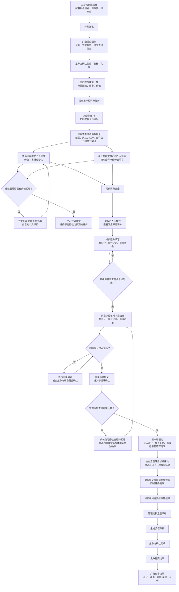

# 啤酒大赛比赛流程说明

本文按当前系统设计整理比赛从赛前配置到结果发布的完整流程，并重点说明评委、桌长、管理端在不同阶段的修改边界。没用过系统的人可以先看流程图，再看后面的角色说明和状态边界。

## 一、总流程图

## 二、第一轮评分和汇总的关键边界

| 阶段 | 可以操作的人 | 可以改什么 | 截止点 |
| --- | --- | --- | --- |
| 评委提交个人评分后 | 当前评委本人 | 自己的分数、各维度备注、总评 | 这款酒被桌长汇总后 |
| 桌长填写某款酒汇总后 | 桌长 | 共识分、综合评语、是否晋级 | 管理端锁定第一轮前 |
| 同桌评委确认后 | 桌长 | 仍可修改桌长汇总结果 | 修改后会进入新的确认版本，需要同桌重新核对或由主办方现场覆盖确认 |
| 本桌结果提交后 | 桌长 | 管理端锁定前仍可调整自己的汇总 | 管理端锁定第一轮后 |
| 管理端锁定第一轮后 | 原则上所有现场角色都不可改 | 本轮个人评分、桌长汇总、晋级结果 | 已作为后续轮候选来源 |

核心规则：

- 评委提交个人评分后，只要桌长还没有汇总这款酒，评委可以修改自己的评价。
- 桌长汇总某款酒后，该酒的普通评委个人评分锁定，不能再改。
- 同桌确认完成后，本桌结果进入管理端确认期。
- 管理端确认并锁定第一轮前，桌长可以修改自己的共识分、综合评语和晋级选择。
- 桌长修改汇总后，系统会按新版本处理确认状态，同桌需要重新核对，或由主办方按现场情况覆盖确认。
- 管理端锁定轮次后，本轮结果作为后续轮或奖项依据，现场角色原则上不再调整。

## 三、角色视角

### 主办方/管理端

1. 创建比赛，配置报名组别、基础风格库、额外报名字段、评分表和评审桌。
2. 开放报名，等待厂商提交酒款和付款。
3. 核对报名、付款、送样、入库状态。
4. 创建第一轮评分任务，分配酒款、评审和桌长。
5. 发布评审任务。
6. 查看各桌评分、桌长汇总、同桌确认和晋级进度。
7. 必要时进行现场覆盖确认，并记录原因。
8. 核对完成后锁定轮次。
9. 创建后续排序轮，锁定排序结果。
10. 生成并确认奖项，发布最终结果。

### 普通评委

1. 登录评委端。
2. 从任务列表进入当前比赛和评审桌。
3. 扫码或输入短编号查看匿名酒款。
4. 按角色评分表填写分数和备注。
5. 在桌长汇总前，可以查看和修改自己的评价。
6. 桌长完成本桌结果后，核对共识分、综合评语和晋级名单。
7. 确认本桌结果后，等待主办方确认轮次。

### 桌长

1. 与普通评委一样，先完成自己的个人评分。
2. 同桌评分齐全后，进入桌长工作台查看原始评分。
3. 为每款酒填写共识分和综合评语。
4. 按本桌目标数量勾选晋级酒款。
5. 等同桌评委确认，或等待主办方现场覆盖确认。
6. 同桌确认达标后，等待主办方确认轮次。
7. 在管理端锁定前，如发现汇总需要调整，可以修改自己的汇总；修改后需要重新进入确认流程。

### 厂商

1. 在报名开放期间提交酒款。
2. 完成付款后下载标签并提交送样信息。
3. 比赛期间不参与评分流程。
4. 结果发布后查看自己酒款的评分、备注、桌长总结、晋级/奖项结果和证书。

## 四、第一轮与后续轮的区别

| 项目 | 第一轮评分制 | 后续排序轮 |
| --- | --- | --- |
| 主要目标 | 收集个人评分，形成桌长共识结果，选出晋级酒款 | 在晋级候选中做排序、奖项候选或总冠军候选 |
| 评委动作 | 独立评分、写备注、确认本桌结果 | 查看候选，可保存参考排序，确认本桌排序 |
| 桌长动作 | 汇总共识分、综合评语、晋级选择 | 提交正式排序或奖项候选 |
| 管理端动作 | 查看进度、覆盖确认、锁定第一轮 | 锁定排序结果，生成奖项草稿 |
| 修改重点 | 评委评分在桌长汇总后锁定；桌长汇总在管理端锁定前可改 | 排序结果在管理端锁定前可调整，锁定后作为奖项来源 |

## 五、一句话总结

第一轮先让每位评委独立评分；桌长汇总某款酒后，评委不能再改这款酒的个人评价。本桌结果提交后，到管理端锁定轮次前，桌长仍可修改自己的共识分、综合评语和晋级选择；管理端锁定后，本轮结果进入后续轮或奖项确认依据。
